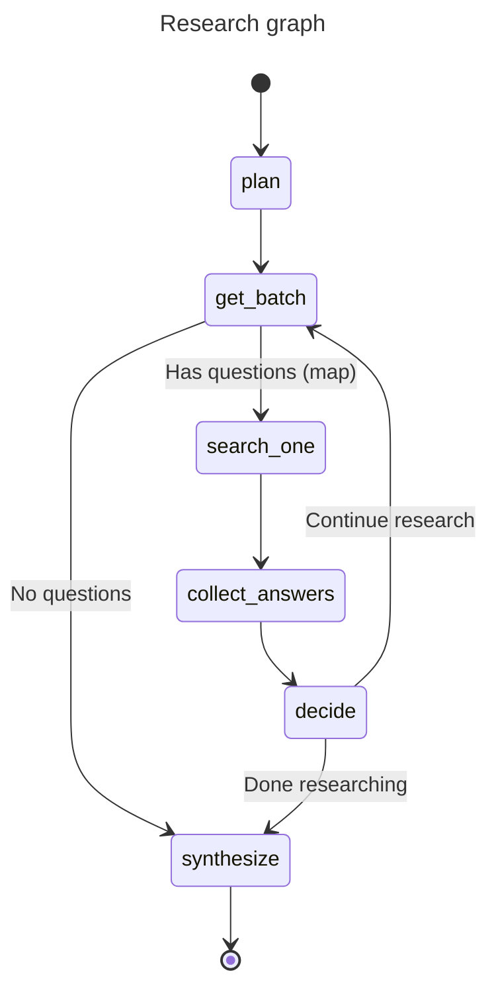

# Agents

Three agentic flows are provided by haiku.rag:

- **Simple QA Agent** — a focused question answering agent
- **Chat Agent** — multi-turn conversational RAG with session memory
- **Research Graph** — a multi-step research workflow with question decomposition

See [QA and Research Configuration](configuration/qa-research.md) for configuring model, iterations, concurrency, and other settings.

## Simple QA Agent

The simple QA agent answers a single question using the knowledge base. It retrieves relevant chunks, optionally expands context around them, and asks the model to answer strictly based on that context.

Key points:

- Uses a single `search_documents` tool to fetch relevant chunks
- Can be run with or without inline citations in the prompt
- Returns a plain string answer

**CLI usage:**

```bash
haiku-rag ask "What is climate change?"

# With citations
haiku-rag ask "What is climate change?" --cite

# Deep mode (uses research graph with optimized settings)
haiku-rag ask "What are the main features of haiku.rag?" --deep
```

**Python usage:**

```python
from haiku.rag.client import HaikuRAG
from haiku.rag.agents.qa.agent import QuestionAnswerAgent

async with HaikuRAG(path_to_db) as client:
    agent = QuestionAnswerAgent(
        client=client,
        provider="openai",
        model="gpt-4o-mini",
        use_citations=False,
    )

    answer = await agent.answer("What is climate change?")
    print(answer)
```

## Chat Agent

The chat agent enables multi-turn conversational RAG. It maintains session state including Q/A history and uses that context to improve follow-up answers.

Key features:

- **Session memory**: Previous Q/A pairs are used as context for follow-up questions
- **Query expansion**: SearchAgent generates multiple query variations for better recall
- **Document filtering**: Natural language document filtering ("search in document X about...")
- **Confidence filtering**: Low-confidence answers are flagged

### Tools

The chat agent uses three tools:

- `search` — Hybrid search with optional document filter
- `ask` — Answer questions using the conversational research graph (automatically recalls prior answers)
- `get_document` — Retrieve a specific document by title or URI

The `ask` tool automatically checks conversation history before running research. It uses embedding similarity (0.7 cosine threshold) to find semantically matching prior answers, which are passed to the research planner as context. When prior answers are sufficient, the planner can skip searching entirely.

### CLI Usage

```bash
haiku-rag chat
haiku-rag chat --db /path/to/database.lancedb
```

See [Applications](apps.md#chat-tui) for the full TUI interface guide.

### Python Usage

```python
from haiku.rag.client import HaikuRAG
from haiku.rag.agents.chat import create_chat_agent, ChatDeps, ChatSessionState

async with HaikuRAG(path_to_db) as client:
    # Create agent and session
    agent = create_chat_agent(config)
    session = ChatSessionState()
    deps = ChatDeps(client=client, config=config, session_state=session)

    # First question
    result = await agent.run("What is haiku.rag?", deps=deps)
    print(result.output)

    # Follow-up (uses session context)
    result = await agent.run("How does it handle PDFs?", deps=deps)
    print(result.output)
```

### Session State

The `ChatSessionState` maintains:

- `session_id` — Unique identifier for the session
- `qa_history` — List of previous Q/A pairs (FIFO, max 50)
- `session_context` — Automatically maintained session context summary
- `document_filter` — List of document titles/URIs to restrict searches
- `citation_registry` — Stable mapping of chunk IDs to citation indices

**Citation Registry**: Citation indices persist across tool calls within a session. The same `chunk_id` always returns the same citation index (first-occurrence-wins). This ensures consistent citation numbering in multi-turn conversations — `[1]` always refers to the same source.

```python
# Example: citation indices are stable across calls
state = ChatSessionState()

# First call returns citations [1], [2], [3]
# Second call reuses [1] if same chunk, assigns [4], [5] for new chunks
# User can reference [1] in follow-up and it still refers to original source
```

Q/A history is used to:

1. Provide context for follow-up questions
2. Avoid repeating previous answers (the `ask` tool automatically recalls relevant prior answers)
3. Enable semantic ranking of relevant past answers

### AG-UI Integration

When using the chat agent with AG-UI streaming, state is emitted under a namespaced key to avoid conflicts with other agents:

```python
from haiku.rag.agents.chat import AGUI_STATE_KEY, ChatDeps, ChatSessionState

# AGUI_STATE_KEY = "haiku.rag.chat"

deps = ChatDeps(
    client=client,
    config=config,
    session_state=ChatSessionState(),
    state_key=AGUI_STATE_KEY,  # Enables namespaced state emission
)
```

The emitted state structure:

```json
{
  "haiku.rag.chat": {
    "session_id": "",
    "citations": [...],
    "qa_history": [...],
    "document_filter": [...],
    "citation_registry": {"chunk-id-1": 1, "chunk-id-2": 2}
  }
}
```

Frontend clients should extract state from under this key. See the [Web Application](apps.md#web-application) for a complete implementation example.

## Research Graph

The research workflow is implemented as a typed pydantic-graph. It plans, searches (in parallel batches), evaluates, and synthesizes into a final report.



**Key nodes:**

- **plan**: Builds up to 3 standalone sub-questions (uses an internal presearch tool)
- **get_batch**: Retrieves remaining sub-questions for the current iteration
- **search_one**: Answers a single sub-question using the KB (mapped in parallel)
- **collect_answers**: Aggregates search results from parallel executions
- **decide**: Evaluates confidence and determines whether to continue or synthesize
- **synthesize**: Generates a final structured research report

**Primary models:**

- `SearchAnswer` — one per sub-question (query, answer, confidence, citations)
- `EvaluationResult` — confidence score, new questions, sufficiency assessment
- `ResearchReport` — final report (title, executive summary, findings, conclusions, …)

**Parallel execution:**

- The `search_one` node is mapped over all questions in a batch
- Parallelism is controlled via `max_concurrency`
- Decision nodes process results after each batch completes

### CLI Usage

```bash
# Basic usage
haiku-rag research "How does haiku.rag organize and query documents?"

# With document filter
haiku-rag research "What are the key findings?" --filter "uri LIKE '%report%'"
```

### Python Usage

**Basic example:**

```python
from haiku.rag.client import HaikuRAG
from haiku.rag.config import Config
from haiku.rag.agents.research.dependencies import ResearchContext
from haiku.rag.agents.research.graph import build_research_graph
from haiku.rag.agents.research.state import ResearchDeps, ResearchState

async with HaikuRAG(path_to_db) as client:
    graph = build_research_graph(config=Config)
    context = ResearchContext(original_question="What are the main features?")
    state = ResearchState.from_config(context=context, config=Config)
    deps = ResearchDeps(client=client)

    report = await graph.run(state=state, deps=deps)

    print(report.title)
    print(report.executive_summary)
```

**With custom config:**

```python
from haiku.rag.client import HaikuRAG
from haiku.rag.config.models import AppConfig, ResearchConfig
from haiku.rag.agents.research.dependencies import ResearchContext
from haiku.rag.agents.research.graph import build_research_graph
from haiku.rag.agents.research.state import ResearchDeps, ResearchState

custom_config = AppConfig(
    research=ResearchConfig(
        provider="openai",
        model="gpt-4o-mini",
        max_iterations=5,
        confidence_threshold=0.85,
        max_concurrency=3,
    )
)

async with HaikuRAG(path_to_db) as client:
    graph = build_research_graph(config=custom_config)
    context = ResearchContext(original_question="What are the main features?")
    state = ResearchState.from_config(context=context, config=custom_config)
    deps = ResearchDeps(client=client)

    report = await graph.run(state=state, deps=deps)
```

### Filtering Documents

Restrict searches to specific documents via the `search_filter` parameter:

```python
# Set filter before running the graph
state = ResearchState.from_config(context=context, config=Config)
state.search_filter = "id IN ('doc-123', 'doc-456')"

report = await graph.run(state=state, deps=deps)
```

The filter applies to all search operations in the graph. See [Filtering Search Results](python.md#filtering-search-results) for available filter columns and syntax.
