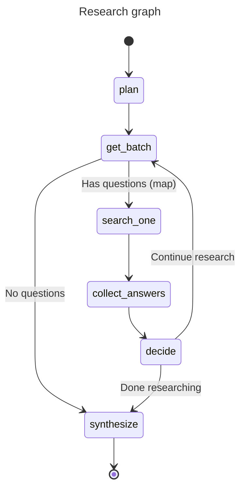

# Agents

Two agentic flows are provided by haiku.rag:

- **Simple QA Agent** — a focused question answering agent
- **Research Graph** — a multi-step research workflow with question decomposition

For an interactive example using Pydantic AI and AG-UI, see the [Interactive Research Assistant](https://github.com/ggozad/haiku.rag/tree/main/examples/ag-ui-research) example ([demo video](https://vimeo.com/1128874386)).

See [QA and Research Configuration](configuration/qa-research.md) for configuring model, iterations, concurrency, and other settings.

## Simple QA Agent

The simple QA agent answers a single question using the knowledge base. It retrieves relevant chunks, optionally expands context around them, and asks the model to answer strictly based on that context.

Key points:

- Uses a single `search_documents` tool to fetch relevant chunks
- Can be run with or without inline citations in the prompt
- Returns a plain string answer

**CLI usage:**

```bash
haiku-rag ask "What is climate change?"

# With citations
haiku-rag ask "What is climate change?" --cite

# Deep mode (uses research graph with optimized settings)
haiku-rag ask "What are the main features of haiku.rag?" --deep
```

**Python usage:**

```python
from haiku.rag.client import HaikuRAG
from haiku.rag.qa.agent import QuestionAnswerAgent

async with HaikuRAG(path_to_db) as client:
    agent = QuestionAnswerAgent(
        client=client,
        provider="openai",
        model="gpt-4o-mini",
        use_citations=False,
    )

    answer = await agent.answer("What is climate change?")
    print(answer)
```

## Research Graph

The research workflow is implemented as a typed pydantic-graph. It plans, searches (in parallel batches), evaluates, and synthesizes into a final report.



**Key nodes:**

- **plan**: Builds up to 3 standalone sub-questions (uses an internal presearch tool)
- **get_batch**: Retrieves remaining sub-questions for the current iteration
- **search_one**: Answers a single sub-question using the KB (mapped in parallel)
- **collect_answers**: Aggregates search results from parallel executions
- **decide**: Evaluates confidence and determines whether to continue or synthesize
- **synthesize**: Generates a final structured research report

**Primary models:**

- `SearchAnswer` — one per sub-question (query, answer, confidence, citations)
- `EvaluationResult` — confidence score, new questions, sufficiency assessment
- `ResearchReport` — final report (title, executive summary, findings, conclusions, …)

**Parallel execution:**

- The `search_one` node is mapped over all questions in a batch
- Parallelism is controlled via `max_concurrency`
- Decision nodes process results after each batch completes

### CLI Usage

```bash
# Basic usage
haiku-rag research "How does haiku.rag organize and query documents?"

# With verbose output (shows progress)
haiku-rag research "How does haiku.rag organize and query documents?" --verbose

# With document filter
haiku-rag research "What are the key findings?" --filter "uri LIKE '%report%'"
```

### Python Usage

**Basic example:**

```python
from haiku.rag.client import HaikuRAG
from haiku.rag.config import Config
from haiku.rag.graph.research.dependencies import ResearchContext
from haiku.rag.graph.research.graph import build_research_graph
from haiku.rag.graph.research.state import ResearchDeps, ResearchState

async with HaikuRAG(path_to_db) as client:
    graph = build_research_graph(config=Config)
    context = ResearchContext(original_question="What are the main features?")
    state = ResearchState.from_config(context=context, config=Config)
    deps = ResearchDeps(client=client)

    report = await graph.run(state=state, deps=deps)

    print(report.title)
    print(report.executive_summary)
```

**With custom config:**

```python
from haiku.rag.client import HaikuRAG
from haiku.rag.config.models import AppConfig, ResearchConfig
from haiku.rag.graph.research.dependencies import ResearchContext
from haiku.rag.graph.research.graph import build_research_graph
from haiku.rag.graph.research.state import ResearchDeps, ResearchState

custom_config = AppConfig(
    research=ResearchConfig(
        provider="openai",
        model="gpt-4o-mini",
        max_iterations=5,
        confidence_threshold=0.85,
        max_concurrency=3,
    )
)

async with HaikuRAG(path_to_db) as client:
    graph = build_research_graph(config=custom_config)
    context = ResearchContext(original_question="What are the main features?")
    state = ResearchState.from_config(context=context, config=custom_config)
    deps = ResearchDeps(client=client)

    report = await graph.run(state=state, deps=deps)
```

**Streaming AG-UI events:**

```python
from haiku.rag.client import HaikuRAG
from haiku.rag.config import Config
from haiku.rag.graph.agui import stream_graph
from haiku.rag.graph.research.dependencies import ResearchContext
from haiku.rag.graph.research.graph import build_research_graph
from haiku.rag.graph.research.state import ResearchDeps, ResearchState

async with HaikuRAG(path_to_db) as client:
    graph = build_research_graph(config=Config)
    context = ResearchContext(original_question="What are the main features?")
    state = ResearchState.from_config(context=context, config=Config)
    deps = ResearchDeps(client=client)

    async for event in stream_graph(graph, state, deps):
        if event["type"] == "STEP_STARTED":
            print(f"Starting step: {event['stepName']}")
        elif event["type"] == "ACTIVITY_SNAPSHOT":
            content = event["content"]
            print(f"  {content['message']}")
            if "confidence" in content:
                print(f"    Confidence: {content['confidence']:.0%}")
        elif event["type"] == "RUN_FINISHED":
            report = event["result"]
            print(report["executive_summary"])
```

### Filtering Documents

Restrict searches to specific documents via the `search_filter` parameter:

```python
# Set filter before running the graph
state = ResearchState.from_config(context=context, config=Config)
state.search_filter = "id IN ('doc-123', 'doc-456')"

report = await graph.run(state=state, deps=deps)
```

The filter applies to all search operations in the graph. See [Filtering Search Results](python.md#filtering-search-results) for available filter columns and syntax.

### Interactive Research Mode

Interactive mode provides human-in-the-loop control over the research process through a conversational interface.

**CLI usage:**

```bash
# Start interactive research mode
haiku-rag research --interactive

# With document filter
haiku-rag research --interactive --filter "uri LIKE '%report%'"
```

In interactive mode, you can:

- Chat with the assistant before starting research
- Review the generated sub-questions after planning
- Add, remove, or modify questions through natural conversation
- Execute searches and review collected answers
- Continue researching or synthesize when ready

For a web-based interactive experience, see the [AG-UI Research Example](https://github.com/ggozad/haiku.rag/tree/main/examples/ag-ui-research).
