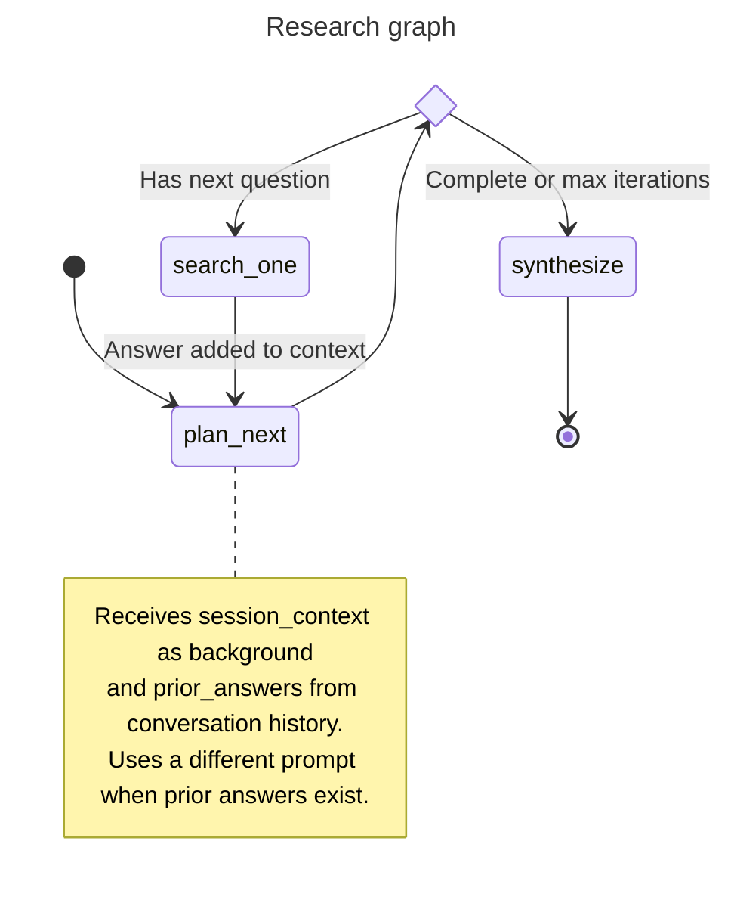

# Agents

Four agentic flows are provided by haiku.rag:

- **Simple QA Agent** — a focused question answering agent
- **Chat Agent** — multi-turn conversational RAG with session memory
- **Research Graph** — a multi-step research workflow with question decomposition
- **RLM Agent** — complex analytical tasks via sandboxed Python code execution (see [RLM Agent](rlm.md))

See [QA and Research Configuration](configuration/qa-research.md) for configuring model, iterations, concurrency, and other settings.

## Simple QA Agent

The simple QA agent answers a single question using the knowledge base. It retrieves relevant chunks, optionally expands context around them, and asks the model to answer strictly based on that context.

Key points:

- Uses a single `search_documents` tool to fetch relevant chunks
- Can be run with or without inline citations in the prompt
- Returns a plain string answer

**CLI usage:**

```bash
haiku-rag ask "What is climate change?"

# With citations
haiku-rag ask "What is climate change?" --cite

# Deep mode (uses research graph with optimized settings)
haiku-rag ask "What are the main features of haiku.rag?" --deep
```

**Python usage:**

```python
from haiku.rag.client import HaikuRAG
from haiku.rag.agents.qa.agent import QuestionAnswerAgent

async with HaikuRAG(path_to_db) as client:
    agent = QuestionAnswerAgent(
        client=client,
        provider="openai",
        model="gpt-4o-mini",
        use_citations=False,
    )

    answer = await agent.answer("What is climate change?")
    print(answer)
```

## Chat Agent

The chat agent enables multi-turn conversational RAG. It maintains session state including Q/A history and uses that context to improve follow-up answers.

Key features:

- **Composable toolsets**: Built from reusable `FunctionToolset` factories in `haiku.rag.tools`
- **Semantic prior answer recall**: The `ask` tool embeds each question and matches it against conversation history — relevant prior answers are passed to the research planner, which can skip searching when they suffice
- **Background summarization**: After each `ask` call, an async background task summarizes the QA history into a compact session context, cached server-side for the next request
- **Session context injection**: The session context summary flows into the research planner as `<background>` XML, letting it resolve ambiguous references ("How does *it* handle X?")
- **Document filtering**: Natural language document filtering ("search in document X about...")

### Tools

The chat agent composes five tools from `haiku.rag.tools`:

- `list_documents` — Browse available documents in the knowledge base
- `summarize_document` — Generate a summary of a specific document
- `get_document` — Retrieve a specific document by title or URI
- `search` — Hybrid search with query expansion and optional document filter
- `ask` — Answer questions using the conversational research graph

### CLI Usage

```bash
haiku-rag chat
haiku-rag chat --db /path/to/database.lancedb
```

See [Applications](apps.md#chat-tui) for the full TUI interface guide.

### Python Usage

```python
from haiku.rag.client import HaikuRAG
from haiku.rag.agents.chat import create_chat_agent, ChatDeps
from haiku.rag.tools import ToolContext

async with HaikuRAG(path_to_db) as client:
    # Create agent with composed toolsets
    context = ToolContext()
    agent = create_chat_agent(config, client, context)
    deps = ChatDeps(config=config, tool_context=context)

    # First question
    result = await agent.run("What is haiku.rag?", deps=deps)
    print(result.output)

    # Follow-up (uses session context)
    result = await agent.run("How does it handle PDFs?", deps=deps)
    print(result.output)
```

### Feature Selection

By default, `create_chat_agent` enables search, documents, and QA toolsets. You can customize which capabilities the agent has via the `features` parameter:

```python
from haiku.rag.agents.chat import (
    create_chat_agent,
    FEATURE_SEARCH,
    FEATURE_DOCUMENTS,
    FEATURE_QA,
    FEATURE_ANALYSIS,
)

# Search-only agent
agent = create_chat_agent(config, client, context, features=[FEATURE_SEARCH])

# All features including code analysis
agent = create_chat_agent(
    config, client, context,
    features=[FEATURE_SEARCH, FEATURE_DOCUMENTS, FEATURE_QA, FEATURE_ANALYSIS],
)
```

Available features:

| Feature | Constant | Tools added |
|---------|----------|-------------|
| Search | `FEATURE_SEARCH` | `search` |
| Documents | `FEATURE_DOCUMENTS` | `list_documents`, `get_document`, `summarize_document` |
| QA | `FEATURE_QA` | `ask` |
| Analysis | `FEATURE_ANALYSIS` | `analyze` |

The system prompt is automatically composed to match the selected features — only guidance for active tools is included. `SessionState` is always registered (shared by all features). `QASessionState` is only registered when the QA feature is active.

### Session State

The `ChatSessionState` maintains:

- `session_id` — Unique identifier for the session
- `qa_history` — List of previous Q/A pairs (FIFO, max 50)
- `session_context` — Automatically maintained session context summary
- `document_filter` — List of document titles/URIs to restrict searches
- `citation_registry` — Stable mapping of chunk IDs to citation indices

**Citation Registry**: Citation indices persist across tool calls within a session. The same `chunk_id` always returns the same citation index (first-occurrence-wins). This ensures consistent citation numbering in multi-turn conversations — `[1]` always refers to the same source.

```python
# Example: citation indices are stable across calls
state = ChatSessionState()

# First call returns citations [1], [2], [3]
# Second call reuses [1] if same chunk, assigns [4], [5] for new chunks
# User can reference [1] in follow-up and it still refers to original source
```

### Conversational Memory

The chat agent maintains two layers of conversational memory that work together:

**1. Semantic prior answer recall**

When the `ask` tool receives a question, it:

1. Embeds the new question
2. Computes cosine similarity against all cached `qa_history` embeddings
3. Selects prior answers above a 0.7 similarity threshold
4. Passes them as `prior_answers` to the research graph's `ResearchContext`

The research planner sees these as `<prior_answers>` in its prompt. If the prior answers already cover the question, the planner marks research as complete and skips directly to synthesis — no new searches needed.

Question embeddings are cached per-session to avoid re-embedding on every turn. Uncached embeddings are batch-computed.

**2. Background session summarization**

After each `ask` call completes, `trigger_background_summarization()` spawns an async task that:

1. Formats the full `qa_history` (questions, answers, confidence, sources) as markdown
2. Sends it to an LLM with the current session context (if any) as input
3. Produces a compact summary capturing key facts, entities, and document references
4. Caches the result server-side under the `session_id`

If a new `ask` fires before the previous summarization finishes, the old task is cancelled. On the next request, the cached summary is picked up and injected as `session_context` into the research planner's `<background>` XML.

This means follow-up questions like "Tell me more about the authentication part" resolve correctly even though the planner never saw the original conversation — it has the summary.

### AG-UI Integration

When using the chat agent with AG-UI streaming, state is emitted under a namespaced key to avoid conflicts with other agents:

```python
from haiku.rag.agents.chat import AGUI_STATE_KEY, ChatDeps
from haiku.rag.tools import ToolContext

# AGUI_STATE_KEY = "haiku.rag.chat"

context = ToolContext()
agent = create_chat_agent(config, client, context)
deps = ChatDeps(
    config=config,
    tool_context=context,
    state_key=AGUI_STATE_KEY,  # Enables namespaced state emission
)
```

The emitted state structure:

```json
{
  "haiku.rag.chat": {
    "session_id": "",
    "citations": [...],
    "qa_history": [...],
    "document_filter": [...],
    "citation_registry": {"chunk-id-1": 1, "chunk-id-2": 2}
  }
}
```

Frontend clients should extract state from under this key. See the [Web Application](apps.md#web-application) for a complete implementation example.

## Research Graph

The research workflow is implemented as a typed pydantic-graph. It uses an iterative feedback loop where the planner proposes one question at a time, sees the answer, then decides whether to continue or synthesize.



The graph receives a `ResearchContext` containing:

- `original_question` — the user's question
- `session_context` — summary of conversation history (injected as `<background>` XML)
- `qa_responses` — prior answers from semantic matching or previous iterations (injected as `<prior_answers>` XML)

When prior answers are provided, the planner uses a context-aware prompt that evaluates whether existing evidence is sufficient. If it is, the planner marks `is_complete=True` and the graph skips directly to synthesis without any searches.

**Key nodes:**

- **plan_next**: Evaluates gathered evidence and either proposes the next question to investigate or marks research as complete. Uses a context-aware prompt when prior answers exist, allowing it to skip research entirely.
- **search_one**: Answers a single question using the knowledge base (up to 3 search calls per question). Each answer is added to `ResearchContext.qa_responses` for the next planning iteration.
- **synthesize**: Generates the final output from all gathered evidence.

**Output modes:**

The graph supports two output modes via `build_research_graph(output_mode=...)`:

| Mode | Output type | Used by |
|------|-------------|---------|
| `"report"` | `ResearchReport` (title, executive summary, findings, conclusions, recommendations) | CLI `haiku-rag research`, Python API |
| `"conversational"` | `ConversationalAnswer` (answer, citations, confidence) | Chat agent's `ask` tool |

**Iterative flow:**

- Each iteration: planner evaluates context → proposes one question → search answers it → loop back
- Planner can decompose complex questions (e.g., "benefits and drawbacks" → start with "benefits")
- Session context resolves ambiguous references and informs planning
- Prior answers let the planner skip redundant searches
- Loop terminates when planner marks `is_complete=True` or `max_iterations` is reached

### CLI Usage

```bash
# Basic usage
haiku-rag research "How does haiku.rag organize and query documents?"

# With document filter
haiku-rag research "What are the key findings?" --filter "uri LIKE '%report%'"
```

### Python Usage

**Basic example:**

```python
from haiku.rag.client import HaikuRAG
from haiku.rag.config import Config
from haiku.rag.agents.research.dependencies import ResearchContext
from haiku.rag.agents.research.graph import build_research_graph
from haiku.rag.agents.research.state import ResearchDeps, ResearchState

async with HaikuRAG(path_to_db) as client:
    graph = build_research_graph(config=Config)
    context = ResearchContext(original_question="What are the main features?")
    state = ResearchState.from_config(context=context, config=Config)
    deps = ResearchDeps(client=client)

    report = await graph.run(state=state, deps=deps)

    print(report.title)
    print(report.executive_summary)
```

**With custom config:**

```python
from haiku.rag.client import HaikuRAG
from haiku.rag.config.models import AppConfig, ResearchConfig
from haiku.rag.agents.research.dependencies import ResearchContext
from haiku.rag.agents.research.graph import build_research_graph
from haiku.rag.agents.research.state import ResearchDeps, ResearchState

custom_config = AppConfig(
    research=ResearchConfig(
        provider="openai",
        model="gpt-4o-mini",
        max_iterations=5,
        max_concurrency=3,
    )
)

async with HaikuRAG(path_to_db) as client:
    graph = build_research_graph(config=custom_config)
    context = ResearchContext(original_question="What are the main features?")
    state = ResearchState.from_config(context=context, config=custom_config)
    deps = ResearchDeps(client=client)

    report = await graph.run(state=state, deps=deps)
```

**Conversational mode with prior answers:**

```python
from haiku.rag.agents.research.dependencies import ResearchContext
from haiku.rag.agents.research.graph import build_research_graph
from haiku.rag.agents.research.models import SearchAnswer
from haiku.rag.agents.research.state import ResearchDeps, ResearchState

# Conversational mode returns ConversationalAnswer instead of ResearchReport
graph = build_research_graph(config=Config, output_mode="conversational")

# Pass session context and prior answers from conversation history
context = ResearchContext(
    original_question="How does it handle authentication?",
    session_context="User is building a Python web app with FastAPI.",
    qa_responses=[
        SearchAnswer(
            query="What authentication methods are supported?",
            answer="JWT and OAuth2 are supported.",
            confidence=0.95,
            cited_chunks=["chunk-1"],
        )
    ],
)
state = ResearchState.from_config(context=context, config=Config)
deps = ResearchDeps(client=client)

result = await graph.run(state=state, deps=deps)
print(result.answer)       # Direct conversational answer
print(result.confidence)   # 0.0-1.0
print(result.citations)    # Deduplicated citations from all searches
```

### Filtering Documents

Restrict searches to specific documents via the `search_filter` parameter:

```python
# Set filter before running the graph
state = ResearchState.from_config(context=context, config=Config)
state.search_filter = "id IN ('doc-123', 'doc-456')"

report = await graph.run(state=state, deps=deps)
```

The filter applies to all search operations in the graph. See [Filtering Search Results](python.md#filtering-search-results) for available filter columns and syntax.
