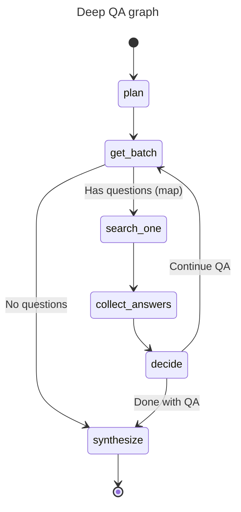
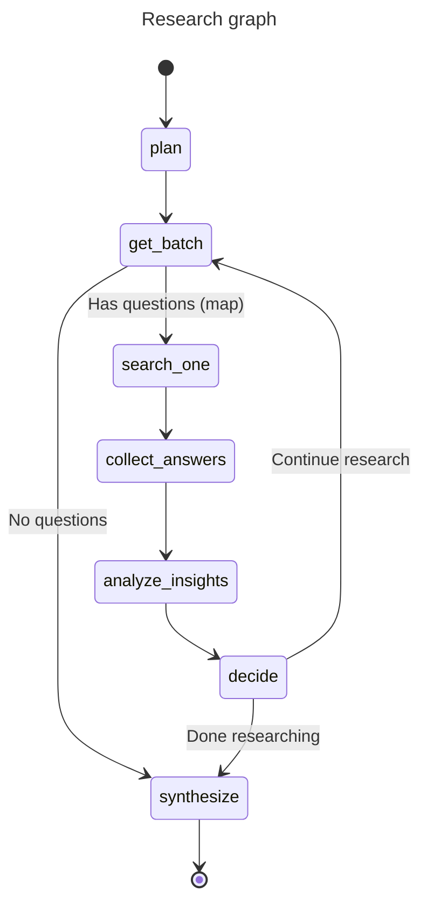

# Agents

Three agentic flows are provided by haiku.rag:

- Simple QA Agent — a focused question answering agent
- Deep QA Agent — multi-agent question decomposition for complex questions
- Research Multi‑Agent — a multi‑step, analyzable research workflow

For an interactive example using Pydantic AI and AG-UI, see the [Interactive Research Assistant](https://github.com/ggozad/haiku.rag/tree/main/examples/ag-ui-research) example ([demo video](https://vimeo.com/1128874386)). The demo uses a knowledge base containing haiku.rag's code and documentation.

See [QA and Research Configuration](configuration/qa-research.md) for configuring model, iterations, concurrency, and other settings.


### Simple QA Agent

The simple QA agent answers a single question using the knowledge base. It retrieves relevant chunks, optionally expands context around them, and asks the model to answer strictly based on that context.

Key points:

- Uses a single `search_documents` tool to fetch relevant chunks
- Can be run with or without inline citations in the prompt (citations prefer
  document titles when present, otherwise URIs)
- Returns a plain string answer

Python usage:

```python
from haiku.rag.client import HaikuRAG
from haiku.rag.qa.agent import QuestionAnswerAgent

async with HaikuRAG(path_to_db) as client:
    # Choose a provider and model (see Configuration for env defaults)
    agent = QuestionAnswerAgent(
        client=client,
        provider="openai",  # or "ollama", "vllm", etc.
        model="gpt-4o-mini",
        use_citations=False,  # set True to bias prompt towards citing sources
    )

    answer = await agent.answer("What is climate change?")
    print(answer)
```

### Deep QA Agent

Deep QA is a multi-agent system that decomposes complex questions into sub-questions, answers them in batches, evaluates sufficiency, and iterates if needed before synthesizing a final answer. It's lighter than the full research workflow but more powerful than the simple QA agent.



Key nodes:

- **plan**: Decomposes the question into focused sub-questions using a presearch tool
- **get_batch**: Retrieves remaining sub-questions for the current iteration
- **search_one**: Answers a single sub-question using the knowledge base (mapped in parallel)
- **collect_answers**: Aggregates search results from parallel executions
- **decide**: Evaluates if sufficient information has been gathered or if more iterations are needed
- **synthesize**: Generates the final comprehensive answer from all gathered information

Key differences from Research:

- **Simpler evaluation**: Uses sufficiency check (not confidence + insight analysis)
- **Direct answers**: Returns just the answer (not a full research report)
- **Question-focused**: Optimized for answering specific questions, not open-ended research
- **Supports citations**: Can include inline source citations like `[document.md]`
- **Configurable iterations**: Control max_iterations (default: 2) and max_concurrency (default: 1)

Note on parallel execution:
- The `search_one` node is mapped over all questions in a batch
- Parallelism is controlled via `max_concurrency`
- All questions in an iteration are processed before evaluation

CLI usage:

```bash
# Deep QA without citations
haiku-rag ask "What are the main features of haiku.rag?" --deep

# Deep QA with citations
haiku-rag ask "What are the main features of haiku.rag?" --deep --cite
```

Python usage:

```python
from haiku.rag.client import HaikuRAG
from haiku.rag.config import Config
from haiku.rag.graph.deep_qa.dependencies import DeepQAContext
from haiku.rag.graph.deep_qa.graph import build_deep_qa_graph
from haiku.rag.graph.deep_qa.state import DeepQADeps, DeepQAState

async with HaikuRAG(path_to_db) as client:
    # Use global config (recommended)
    graph = build_deep_qa_graph(config=Config)
    context = DeepQAContext(
        original_question="What are the main features of haiku.rag?",
        use_citations=True
    )
    state = DeepQAState.from_config(context=context, config=Config)
    deps = DeepQADeps(client=client)

    result = await graph.run(
        state=state,
        deps=deps
    )

    print(result.answer)
    print(result.sources)
```

Alternative usage with custom config:

```python
# Create a custom config with different settings
from haiku.rag.config.models import AppConfig, QAConfig

custom_config = AppConfig(
    qa=QAConfig(
        provider="openai",
        model="gpt-4o-mini",
        max_sub_questions=5,
        max_iterations=3,
        max_concurrency=2,
    )
)

graph = build_deep_qa_graph(config=custom_config)
context = DeepQAContext(
    original_question="What are the main features of haiku.rag?",
    use_citations=True
)
state = DeepQAState.from_config(context=context, config=custom_config)
deps = DeepQADeps(client=client)

result = await graph.run(state=state, deps=deps)
```

### Research Graph

The research workflow is implemented as a typed pydantic‑graph. It plans, searches (in parallel batches), evaluates, and synthesizes into a final report — with clear stop conditions and shared state.



Key nodes:

- **plan**: Builds up to 3 standalone sub‑questions (uses an internal presearch tool)
- **get_batch**: Retrieves remaining sub‑questions for the current iteration
- **search_one**: Answers a single sub‑question using the KB with minimal, verbatim context (mapped in parallel)
- **collect_answers**: Aggregates search results from parallel executions
- **analyze_insights**: Synthesizes fresh insights, updates gaps, and suggests new sub-questions
- **decide**: Checks sufficiency/confidence thresholds and determines whether to continue research
- **synthesize**: Generates a final structured research report

Primary models:

- `SearchAnswer` — one per sub‑question (query, answer, context, sources)
- `InsightRecord` / `GapRecord` — structured tracking of findings and open issues
- `InsightAnalysis` — output of the analysis stage (insights, gaps, commentary)
- `EvaluationResult` — insights, new questions, sufficiency, confidence
- `ResearchReport` — final report (title, executive summary, findings, conclusions, …)

Note on parallel execution:
- The `search_one` node is mapped over all questions in a batch
- Parallelism is controlled via `max_concurrency`
- Analysis and decision nodes process results after each batch completes

CLI usage:

```bash
# Basic usage (uses config from file or defaults)
haiku-rag research "How does haiku.rag organize and query documents?" --verbose

# With custom config file
haiku-rag --config my-research-config.yaml research "How does haiku.rag organize and query documents?" --verbose
```

Python usage (blocking result):

```python
from haiku.rag.client import HaikuRAG
from haiku.rag.config import Config
from haiku.rag.graph.research.dependencies import ResearchContext
from haiku.rag.graph.research.graph import build_research_graph
from haiku.rag.graph.research.state import ResearchDeps, ResearchState

async with HaikuRAG(path_to_db) as client:
    # Use global config (recommended)
    graph = build_research_graph(config=Config)
    question = "What are the main drivers and trends of global temperature anomalies since 1990?"
    context = ResearchContext(original_question=question)
    state = ResearchState.from_config(context=context, config=Config)
    deps = ResearchDeps(client=client)

    result = await graph.run(
        state=state,
        deps=deps,
    )

    report = result
    print(report.title)
    print(report.executive_summary)
```

### Filtering Documents

Both Research and Deep QA graphs support restricting searches to specific documents via the `search_filter` parameter. Set it to a SQL WHERE clause before running:

```python
state = ResearchState.from_config(context=context, config=Config)
# Only search documents with these IDs
state.search_filter = "id IN ('doc-123', 'doc-456')"

result = await graph.run(state=state, deps=deps)
```

The filter applies to all search operations in the graph (context gathering and sub-question searches). See [Filtering Search Results](python.md#filtering-search-results) for available filter columns and syntax.

Alternative usage with custom config:

```python
from haiku.rag.config.models import AppConfig, ResearchConfig

custom_config = AppConfig(
    research=ResearchConfig(
        provider="openai",
        model="gpt-4o-mini",
        max_iterations=5,
        confidence_threshold=0.85,
        max_concurrency=3,
    )
)

graph = build_research_graph(config=custom_config)
context = ResearchContext(original_question=question)
state = ResearchState.from_config(context=context, config=custom_config)
deps = ResearchDeps(client=client)

result = await graph.run(state=state, deps=deps)
```

Python usage (streamed AG-UI events):

```python
from haiku.rag.graph.agui import stream_graph
from haiku.rag.client import HaikuRAG
from haiku.rag.config import Config
from haiku.rag.graph.research.dependencies import ResearchContext
from haiku.rag.graph.research.graph import build_research_graph
from haiku.rag.graph.research.state import ResearchDeps, ResearchState

async with HaikuRAG(path_to_db) as client:
    graph = build_research_graph(config=Config)
    question = "What are the main drivers and trends of global temperature anomalies since 1990?"
    context = ResearchContext(original_question=question)
    state = ResearchState.from_config(context=context, config=Config)
    deps = ResearchDeps(client=client)

    async for event in stream_graph(graph, state, deps):
        if event["type"] == "STEP_STARTED":
            print(f"Starting step: {event['stepName']}")
        elif event["type"] == "ACTIVITY_SNAPSHOT":
            # Activity events include structured data alongside messages
            content = event['content']
            print(f"  {content['message']}")

            # Different activity types have different structured fields
            if 'confidence' in content:
                print(f"    Confidence: {content['confidence']:.0%}")
            if 'sub_questions' in content:
                for q in content['sub_questions']:
                    print(f"    - {q}")
            if 'insights' in content:
                print(f"    New insights: {len(content['insights'])}")
        elif event["type"] == "RUN_FINISHED":
            print("\nResearch complete!\n")
            result = event["result"]
            print(result["title"])
            print(result["executive_summary"])
```
