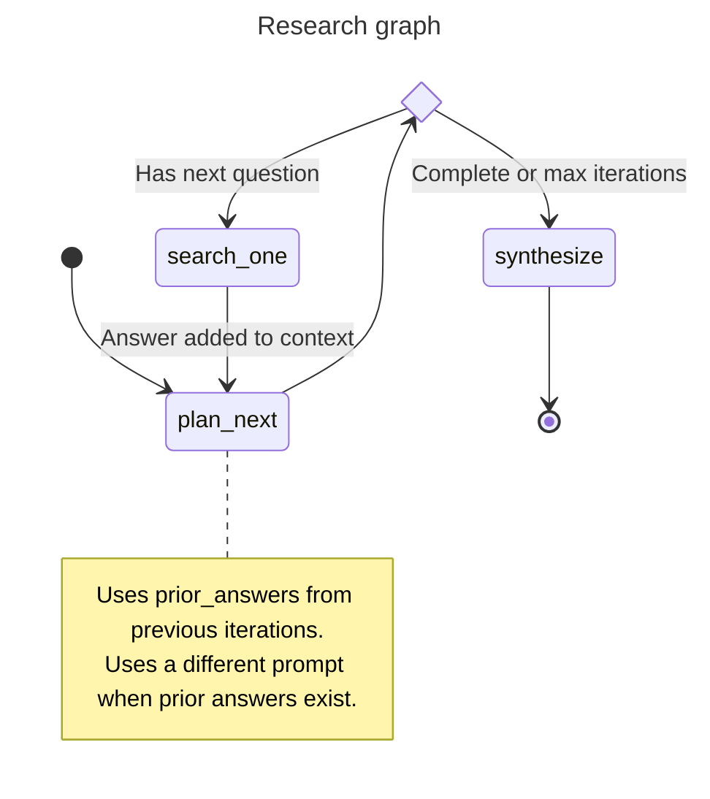

# Agents

Three agentic flows are provided by haiku.rag:

- **Simple QA Agent** — a focused question answering agent
- **Research Graph** — a multi-step research workflow with question decomposition
- **RLM Agent** — complex analytical tasks via sandboxed Python code execution (see [RLM Agent](rlm.md))

For multi-turn conversational RAG, haiku.rag provides [skills](../skills/index.md) built on [haiku.skills](https://github.com/ggozad/haiku.skills). The skills bundle search, Q&A, analysis, and research tools with session state management.

See [QA and Research Configuration](../configuration/qa-research.md) for configuring model, iterations, concurrency, and other settings.

## Simple QA Agent

The simple QA agent answers a single question using the knowledge base. It retrieves relevant chunks, optionally expands context around them, and asks the model to answer strictly based on that context.

Key points:

- Uses a single `search_documents` tool to fetch relevant chunks
- Can be run with or without inline citations in the prompt
- Returns a plain string answer

**CLI usage:**

```bash
haiku-rag ask "What is climate change?"

# With citations
haiku-rag ask "What is climate change?" --cite
```

**Python usage:**

```python
from haiku.rag.client import HaikuRAG
from haiku.rag.config.models import ModelConfig
from haiku.rag.agents.qa.agent import QuestionAnswerAgent

async with HaikuRAG(path_to_db) as client:
    agent = QuestionAnswerAgent(
        client=client,
        model_config=ModelConfig(provider="openai", name="gpt-4o-mini"),
    )

    answer, citations = await agent.answer("What is climate change?")
    print(answer)
```

## Research Graph

The research workflow is implemented as a typed pydantic-graph. It uses an iterative feedback loop where the planner proposes one question at a time, sees the answer, then decides whether to continue or synthesize.



The graph receives a `ResearchContext` containing:

- `original_question` — the user's question
- `qa_responses` — prior answers from previous iterations (injected as `<prior_answers>` XML)

When prior answers are provided, the planner uses a context-aware prompt that evaluates whether existing evidence is sufficient. If it is, the planner marks `is_complete=True` and the graph skips directly to synthesis without any searches.

**Key nodes:**

- **plan_next**: Evaluates gathered evidence and either proposes the next question to investigate or marks research as complete. Uses a context-aware prompt when prior answers exist, allowing it to skip research entirely.
- **search_one**: Answers a single question using the knowledge base (up to 3 search calls per question). Each answer is added to `ResearchContext.qa_responses` for the next planning iteration.
- **synthesize**: Generates the final output from all gathered evidence.

**Iterative flow:**

- Each iteration: planner evaluates context → proposes one question → search answers it → loop back
- Planner can decompose complex questions (e.g., "benefits and drawbacks" → start with "benefits")
- Prior answers let the planner skip redundant searches
- Loop terminates when planner marks `is_complete=True` or `max_iterations` is reached

### CLI Usage

```bash
# Basic usage
haiku-rag research "How does haiku.rag organize and query documents?"

# With document filter
haiku-rag research "What are the key findings?" --filter "uri LIKE '%report%'"
```

### Python Usage

**Basic example:**

```python
from haiku.rag.client import HaikuRAG
from haiku.rag.config import Config
from haiku.rag.agents.research.dependencies import ResearchContext
from haiku.rag.agents.research.graph import build_research_graph
from haiku.rag.agents.research.state import ResearchDeps, ResearchState

async with HaikuRAG(path_to_db) as client:
    graph = build_research_graph(config=Config)
    context = ResearchContext(original_question="What are the main features?")
    state = ResearchState.from_config(context=context, config=Config)
    deps = ResearchDeps(client=client)

    report = await graph.run(state=state, deps=deps)

    print(report.title)
    print(report.executive_summary)
```

**With custom config:**

```python
from haiku.rag.client import HaikuRAG
from haiku.rag.config.models import AppConfig, ModelConfig, ResearchConfig
from haiku.rag.agents.research.dependencies import ResearchContext
from haiku.rag.agents.research.graph import build_research_graph
from haiku.rag.agents.research.state import ResearchDeps, ResearchState

custom_config = AppConfig(
    research=ResearchConfig(
        model=ModelConfig(provider="openai", name="gpt-4o-mini"),
        max_iterations=5,
        max_concurrency=3,
    )
)

async with HaikuRAG(path_to_db) as client:
    graph = build_research_graph(config=custom_config)
    context = ResearchContext(original_question="What are the main features?")
    state = ResearchState.from_config(context=context, config=custom_config)
    deps = ResearchDeps(client=client)

    report = await graph.run(state=state, deps=deps)
```

### Filtering Documents

Restrict searches to specific documents via the `search_filter` parameter:

```python
# Set filter before running the graph
state = ResearchState.from_config(context=context, config=Config)
state.search_filter = "id IN ('doc-123', 'doc-456')"

report = await graph.run(state=state, deps=deps)
```

The filter applies to all search operations in the graph. See [Filtering Search Results](../python.md#filtering-search-results) for available filter columns and syntax.
