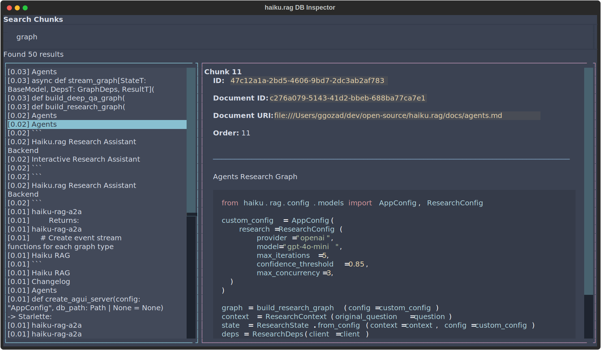
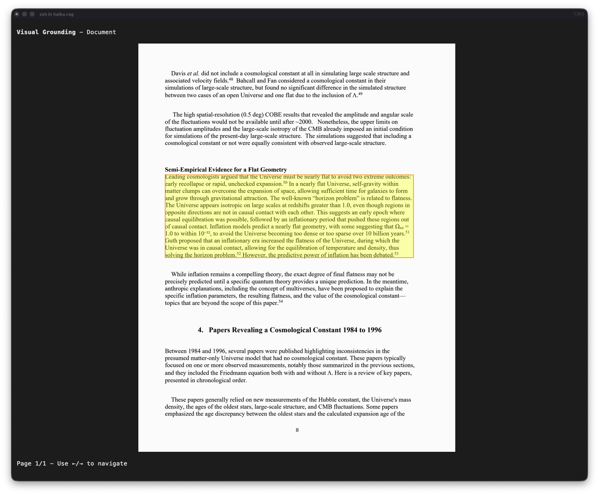

# Applications

Three interactive applications for working with your knowledge base.

## Chat TUI

Conversational RAG from the terminal with streaming responses and session memory.

!!! note
    Requires the `tui` extra: `pip install haiku.rag-slim[tui]` (included in full `haiku.rag` package)

### Usage

```bash
haiku-rag chat
haiku-rag chat --db /path/to/database.lancedb
```

### Interface

The chat interface provides:

- Streaming responses with real-time tool execution indicators
- Expandable citations showing source document, pages, and headings
- Session memory for context-aware follow-up questions
- Visual grounding to inspect chunk source locations


<div style="padding:56.25% 0 0 0;position:relative;"><iframe src="https://player.vimeo.com/video/1159658167?badge=0&amp;autopause=0&amp;player_id=0&amp;app_id=58479" frameborder="0" allow="autoplay; fullscreen; picture-in-picture; clipboard-write; encrypted-media" style="position:absolute;top:0;left:0;width:100%;height:100%;" title="haiku.rag Chat TUI demo"></iframe></div><script src="https://player.vimeo.com/api/player.js"></script>

*Demo: Chatting with an agent over 1000 arXiv papers. Shows context building (3:00), citations with visual grounding (3:20), and document listing/retrieval.*

### Command Palette

Press `Ctrl+P` to open the command palette:

| Command | Description |
|---------|-------------|
| View state | View the current session state |
| Filter documents | Select documents to restrict searches |
| Show database info | View document/chunk counts and storage info |
| Visual grounding | View chunk source location in document |
| Clear chat | Clear chat history and reset session |

### Session Management

- Conversation history is maintained in memory for the session
- Previous Q/A pairs are automatically used as context for follow-up questions via the `ask` tool
- Citations are tracked per response and can be inspected
- Document filter restricts all searches to selected documents
- Clearing chat resets session state

## Web Application

Browser-based conversational RAG with a CopilotKit frontend.

### Features

- Streaming chat with real-time tool execution visibility
- Expandable citations with source documents, pages, and headings
- Visual grounding to view chunk source locations in documents
- Document filter to restrict searches to selected documents
- Session state view for inspecting accumulated Q&A history, citations, and documents

### Quick Start

```bash
cd app
docker compose -f docker-compose.dev.yml up -d --build
```

- Frontend: http://localhost:3000
- Backend: http://localhost:8001

### Architecture

- **Backend**: Starlette server with pydantic-ai `AGUIAdapter`
- **Frontend**: Next.js with CopilotKit
- **Protocol**: AG-UI for streaming chat

### Configuration

Create a `.env` file in the `app/` directory:

```bash
# API Keys (at least one required)
ANTHROPIC_API_KEY=your-anthropic-key
OPENAI_API_KEY=your-openai-key

# Database path
DB_PATH=/path/to/your/haiku.rag.lancedb

# Optional: Ollama base URL (if using local models)
OLLAMA_BASE_URL=http://localhost:11434

# Optional: Logfire for observability
LOGFIRE_TOKEN=your-logfire-token
```

For full configuration, mount a `haiku.rag.yaml` file:

```yaml
# app/haiku.rag.yaml
qa:
  model:
    provider: anthropic
    name: claude-sonnet-4-20250514
```

### API Endpoints

| Endpoint | Method | Description |
|----------|--------|-------------|
| `/v1/chat/stream` | POST | AG-UI chat streaming |
| `/api/documents` | GET | List all documents |
| `/api/info` | GET | Database statistics |
| `/api/visualize/{chunk_id}` | GET | Visual grounding images (base64) |
| `/health` | GET | Health check |

### Development

**Hot reload**: The backend reloads automatically on file changes. For frontend changes:

```bash
docker compose -f docker-compose.dev.yml up -d --build frontend
```

**Logfire debugging**: If `LOGFIRE_TOKEN` is set, LLM calls are traced and available in the Logfire dashboard.

## Inspector

TUI for browsing documents, chunks, and search results.

!!! note
    Requires the `tui` extra: `pip install haiku.rag-slim[tui]` (included in full `haiku.rag` package)

### Usage

```bash
haiku-rag inspect
haiku-rag inspect --db /path/to/database.lancedb
```

### Interface

Three panels display your data:

- **Documents** (left) - All documents in the database
- **Chunks** (top right) - Chunks for the selected document
- **Detail View** (bottom right) - Full content and metadata



### Navigation

| Key | Action |
|-----|--------|
| `Tab` | Cycle between panels |
| `↑` / `↓` | Navigate lists |
| `/` | Open search modal |
| `c` | Context expansion modal (when viewing a chunk) |
| `v` | Visual grounding modal (when viewing a chunk) |
| `q` | Quit |

**Mouse**: Click to select, scroll to view content.

### Search

Press `/` to open the full-screen search modal:

- Enter your query and press `Enter` to search
- **Left panel**: Search results with relevance scores `[0.95] content preview`
- **Right panel**: Full chunk content and metadata
- Use `↑` / `↓` to navigate results
- Press `Enter` on a result to navigate to that document/chunk
- Press `Esc` to close search

Search uses hybrid (vector + full-text) search across all chunks.

### Context Expansion

Press `c` while viewing a chunk to see the expanded context that would be provided to the QA agent:

- Type-aware expansion: tables, code blocks, and lists expand to their complete structures
- Text content expands based on `search.context_radius` setting
- Includes metadata like source document, content type, and relevance score

### Visual Grounding

Visual grounding shows exactly where a chunk appears in the original document by highlighting its bounding box on the page image. This helps verify chunk boundaries and understand how content was extracted.

Press `v` while viewing a chunk to see page images with the chunk's location highlighted:

- Bounding boxes show the exact region of the page that maps to the chunk
- Use `←` / `→` arrow keys to navigate between pages when a chunk spans multiple pages
- Press `Esc` to close the modal



#### Requirements

- **Page images**: Documents must be processed with Docling's page image extraction enabled (default for PDFs)
- **Terminal image support**: Your terminal must support inline images (e.g., iTerm2, WezTerm, Kitty). Terminals without image support will show a placeholder message.
- **DoclingDocument storage**: Text-only documents (plain text, markdown added via `add`) don't have visual grounding available

!!! tip
    You can also view visual grounding from the command line with `haiku-rag visualize <chunk_id>`. See [CLI documentation](cli.md#visualize-chunk) for details.
