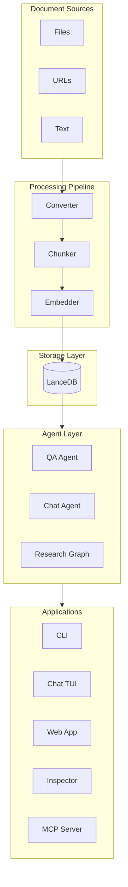
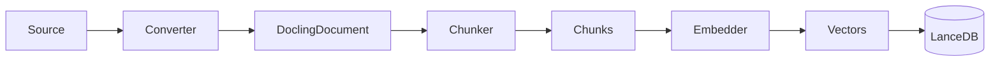
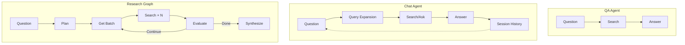
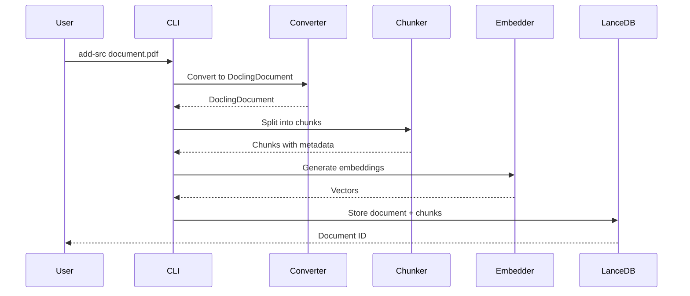
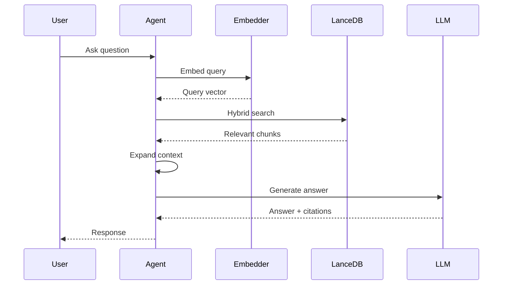

# Architecture

High-level overview of haiku.rag components and data flow.

## System Overview



## Core Components

### Storage Layer

LanceDB provides vector storage with full-text search capabilities:

- **DocumentRecord** - Document metadata and full content
- **ChunkRecord** - Text chunks with embeddings and structural metadata
- **SettingsRecord** - Database configuration and version info

Repositories handle CRUD operations:

- `DocumentRepository` - Create, read, update, delete documents
- `ChunkRepository` - Chunk management and hybrid search
- `SettingsRepository` - Configuration persistence

### Processing Pipeline



**Converters** transform sources into DoclingDocuments:

- `docling-local` - Local Docling processing
- `docling-serve` - Remote processing via docling-serve

**Chunkers** split documents into semantic chunks:

- Preserves document structure (tables, lists, code blocks)
- Maintains provenance (page numbers, headings)
- Configurable chunk size

**Embedders** generate vector representations:

| Provider | Models |
|----------|--------|
| Ollama | nomic-embed-text, mxbai-embed-large |
| OpenAI | text-embedding-3-small, text-embedding-3-large |
| VoyageAI | voyage-3, voyage-code-3 |
| vLLM | Any compatible model |
| LM Studio | Any compatible model |

### Agent Layer

Three agent types for different use cases:



**QA Agent** - Single-turn question answering:

- Searches for relevant chunks
- Expands context around results
- Generates answer with optional citations

**Chat Agent** - Multi-turn conversational RAG:

- Maintains session history
- Uses previous Q/A pairs as context
- Query expansion for better recall
- Natural language document filtering

**Research Graph** - Multi-step research workflow:

- Decomposes questions into sub-questions
- Parallel search execution
- Iterative refinement based on confidence
- Synthesizes structured research report

### Applications

| Application | Interface | Use Case |
|-------------|-----------|----------|
| CLI | Command line | Scripts, one-off queries, batch processing |
| Chat TUI | Terminal | Interactive conversations |
| Web App | Browser | Team collaboration, visual interface |
| Inspector | Terminal | Database exploration, debugging |
| MCP Server | Protocol | AI assistant integration |

## Data Flow

### Document Ingestion



### Search and QA



## Configuration

Configuration flows through the system:

```
CLI args → Environment variables → haiku.rag.yaml → Defaults
```

Key configuration areas:

- **Storage** - Database path, vacuum settings
- **Embeddings** - Provider, model, dimensions
- **Processing** - Chunk size, converter, chunker
- **Search** - Limits, context expansion
- **QA/Research** - Model, iterations, concurrency
- **Providers** - Ollama, vLLM, docling-serve URLs

See [Configuration](configuration/index.md) for details.
