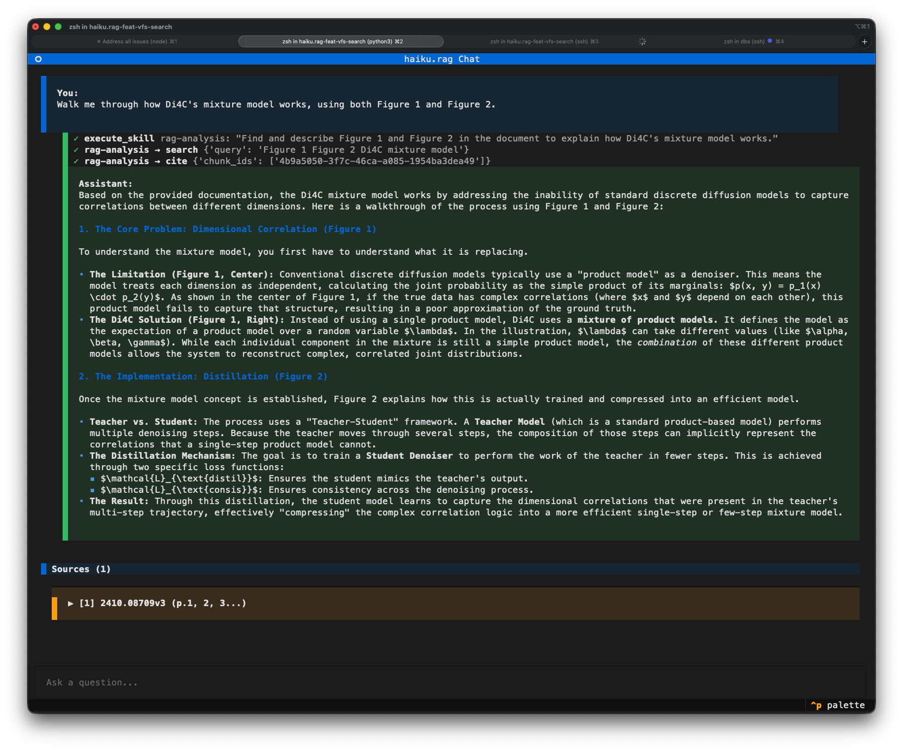
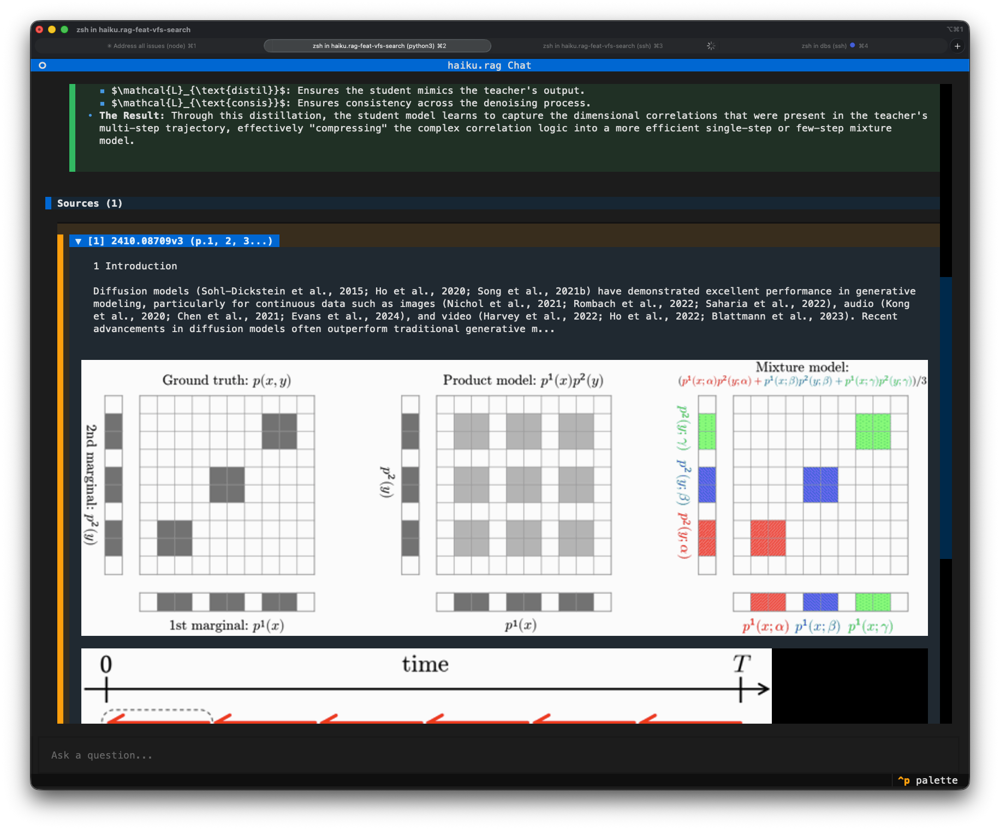

# Chat

The chat TUI runs conversational RAG against your database from the terminal. Streaming responses, expandable citations with visual grounding, multi-turn sessions, and a command palette for filtering and inspection.

!!! note
    Requires the `tui` extra: `pip install haiku.rag-slim[tui]` (included in the full `haiku.rag` package).

## Run it

```bash
haiku-rag chat
haiku-rag chat --db /path/to/database.lancedb
haiku-rag chat --model openai:gpt-4o
```



## How it works

The chat is a Pydantic AI agent with the `rag` [skill](skills/rag.md) attached by default. Each turn the agent decides which tool to call next, runs hybrid search against your documents, expands context around the hits, may issue further searches, and answers with citations. You see streaming text and a live indicator of which tool is running.

The session is in-memory for the lifetime of the TUI. Conversation history is kept across turns so follow-up questions reuse prior context. Citations are tracked per turn and inspectable via the command palette. Clearing the chat resets the session and the agent's memory.

## Citations and visual grounding

Each answer cites the chunks the agent used, with source document, page numbers, and section headings. Citations are expandable inline. Picture citations render the figure directly underneath the text snippet.



For visual grounding of a text chunk (the chunk highlighted on its source page image), open the command palette and pick "Show visual grounding". This requires:

- Documents processed via Docling with page images (default for PDFs).
- A terminal that supports inline images (iTerm2, WezTerm, Kitty).
- A stored DoclingDocument on the document. Plain text added via `haiku-rag add` doesn't have it.

You can also render visual grounding from the CLI without launching the TUI:

```bash
haiku-rag visualize <chunk_id>
```

## Command palette

`Ctrl+P` opens the palette.

| Command | What it does |
|---------|--------------|
| Clear chat | Reset session memory |
| Filter documents | Restrict searches to selected documents |
| Show visual grounding | Visual grounding for a citation |
| Database info | Document and chunk counts, storage stats |
| View state | Current session state, citations, and intermediate tool results |

## Skills

The default skill is `rag`. Enable `analysis` when the question needs computation, aggregation, comparison across documents, or section-scoped reading that a single search can't deliver:

```bash
# both skills (the agent routes between them)
haiku-rag chat -s rag -s analysis

# analysis only
haiku-rag chat -s analysis
```

The `analysis` skill mounts every document as a virtual filesystem at `/documents/{id}/` (with `metadata.json`, `content.txt`, `items.jsonl`, and `toc.json`) and runs Python in a sandboxed interpreter with `search` and `list_documents` as awaitable functions. It's the right choice for questions like:

- "How many of these documents mention X?"
- "Summarize Section 5 of paper Y."
- "Compare the experimental sections across these three reports."
- "Which section discusses the proof of Theorem 4.10?"

For everyday Q&A, the rag skill alone is faster and cheaper. Attaching both lets the agent pick. See [Analysis skill](skills/analysis.md) for the full sandbox capabilities and worked code patterns.

## Document filter

Run "Filter documents" from the command palette to restrict searches to a subset. The filter applies to every search the agent runs for the rest of the session.

Chat also honors the global `--read-only` and `--before` flags. See the [CLI reference](cli.md) for details.
