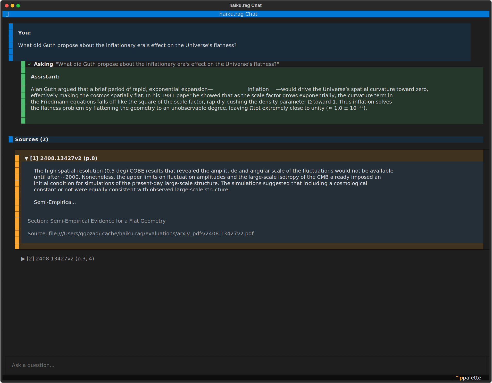

# Chat

The chat TUI runs conversational RAG against your database from the terminal. Streaming responses, expandable citations with visual grounding, multi-turn sessions, and a command palette for filtering and inspection.

!!! note
    Requires the `tui` extra: `pip install haiku.rag-slim[tui]` (included in the full `haiku.rag` package).

## Run it

```bash
haiku-rag chat
haiku-rag chat --db /path/to/database.lancedb
haiku-rag chat --model openai:gpt-4o
```



<div style="padding:56.25% 0 0 0;position:relative;"><iframe src="https://player.vimeo.com/video/1159658167?badge=0&amp;autopause=0&amp;player_id=0&amp;app_id=58479" frameborder="0" allow="autoplay; fullscreen; picture-in-picture; clipboard-write; encrypted-media" style="position:absolute;top:0;left:0;width:100%;height:100%;" title="haiku.rag Chat TUI demo"></iframe></div><script src="https://player.vimeo.com/api/player.js"></script>

*Demo: chatting with an agent over 1000 arXiv papers. Shows context building (3:00), citations with visual grounding (3:20), and document listing.*

## How it works

The chat is a Pydantic AI agent with the `rag` [skill](skills/rag.md) attached. Each turn the agent decides which tool to call next, runs hybrid search against your documents, expands context around the hits, may issue further searches, and answers with citations. You see streaming text and a live indicator of which tool is running.

The session is in-memory for the lifetime of the TUI. Conversation history is kept across turns so follow-up questions reuse prior context. Citations are tracked per turn and inspectable via the command palette. Clearing the chat resets the session and the agent's memory.

## Citations and visual grounding

Each answer cites the chunks the agent used, with source document, page numbers, and section headings. Citations are expandable inline.

For visual grounding (the chunk highlighted on its page image), open the command palette and pick "Show visual grounding". This requires:

- Documents processed via Docling with page images (default for PDFs).
- A terminal that supports inline images (iTerm2, WezTerm, Kitty).
- A stored DoclingDocument on the document. Plain text added via `haiku-rag add` doesn't have it.

You can also render visual grounding from the CLI without launching the TUI:

```bash
haiku-rag visualize <chunk_id>
```

## Command palette

`Ctrl+P` opens the palette.

| Command | What it does |
|---------|--------------|
| Clear chat | Reset session memory |
| Filter documents | Restrict searches to selected documents |
| Show visual grounding | Visual grounding for a citation |
| Database info | Document and chunk counts, storage stats |
| View state | Current session state, citations, and intermediate tool results |

## Skills

The default skill is `rag`. Add `analysis` for sandboxed Python execution over your documents:

```bash
# both skills
haiku-rag chat -s rag -s analysis

# analysis only
haiku-rag chat -s analysis
```

The `analysis` skill mounts a virtual filesystem under `/documents/{id}/` and runs Python code against it inside a sandbox. Useful for aggregation, computation, and multi-document analysis. See [Analysis skill](skills/analysis.md).

## Document filter

Run "Filter documents" from the command palette to restrict searches to a subset. The filter applies to every search the agent runs for the rest of the session.

Chat also honors the global `--read-only` and `--before` flags. See the [CLI reference](cli.md) for details.
