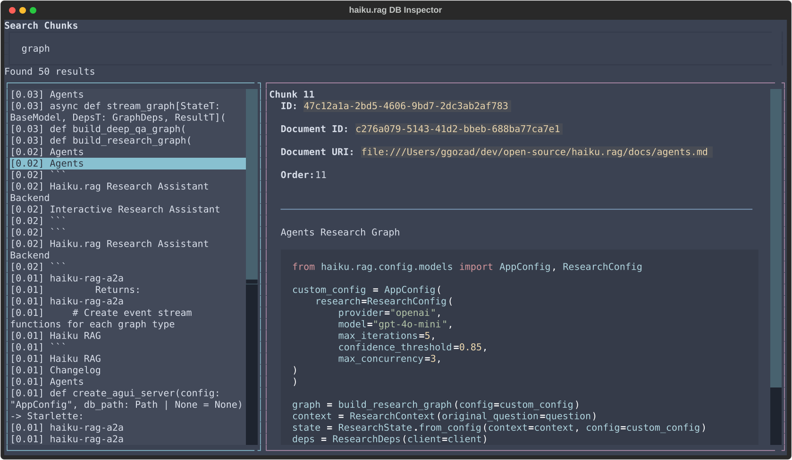
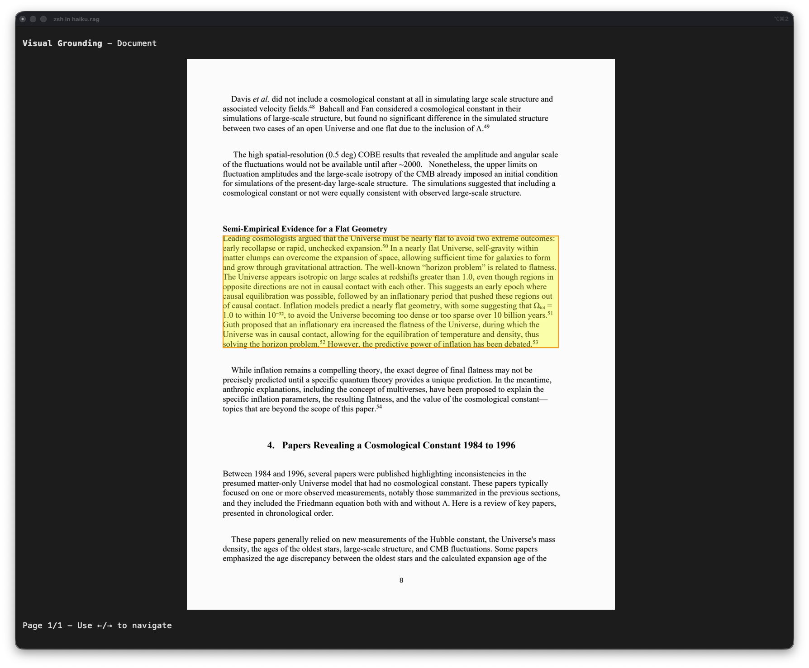

# Chat and inspector

Two terminal apps run against a database: the chat, for conversational RAG, and the inspector, for browsing documents and chunks and seeing what search returns. Both need the `tui` extra, which the full `haiku.rag` package includes, and both open the database read-only.

## Chat

```bash
haiku-rag chat
haiku-rag chat --db /path/to/database.lancedb
haiku-rag chat --model openai:gpt-4o
```


The chat is a Pydantic AI agent with the [RAG capability](capabilities/rag.md). Each turn it searches, expands context around the hits, may search again or run code over the documents, and answers with citations. Text and tool events stream as they happen.

The session lives in memory for the life of the app. History carries across turns, so follow-up questions reuse earlier context. "Clear chat" resets the history, citations and evidence.

### Keys

| Key | Action |
|-----|--------|
| `Enter` | Send the message |
| `Shift+Enter` | New line |
| `Esc` | Focus the input, or cancel a running response |
| `Ctrl+I` | Attach an image |
| `Ctrl+P` | Command palette |

The command palette holds:

| Command | What it does |
|---------|--------------|
| Clear chat | Reset the session |
| Filter documents | Restrict searches to selected documents |
| Show visual grounding | Visual grounding for the selected citation |
| Database info | Document and chunk counts, storage stats |

### Citations and visual grounding

Each answer cites the chunks it used, with source document, page numbers and section headings. Citations expand inline, and a picture citation shows the figure under its text.


To see a cited text chunk highlighted on its page, select the citation and run "Show visual grounding". It needs a terminal with inline images (iTerm2, WezTerm, Kitty) and a document converted by Docling with page images, which PDFs have by default. Text added with `haiku-rag add` has none. `haiku-rag visualize CHUNK_ID` does the same from the CLI.

### Code

When a question needs counting, aggregation or reading across documents, the model runs Python in the capability's [sandbox](capabilities/rag.md#sandbox). The last successful program behind an answer is shown under it.

### Attaching images

`Ctrl+I` opens an image picker: a directory tree of image files with a live preview. Choosing one inserts an `[Image #N]` token at the cursor and attaches the image to the next message. A token deletes as a unit, and its position sets where the image sits relative to your text. Retrieval stays text-based. The image goes to the model with the message, so the model needs `vision: true`.

### Document filter

"Filter documents" restricts every search the agent runs to the selected documents. The filter stays in force after "Clear chat".

## Inspector

```bash
haiku-rag inspect
haiku-rag inspect --db /path/to/database.lancedb
```

The inspector runs the same hybrid search and context expansion the RAG capability uses, so it shows what a model would receive for a query. Three panels list the documents (left), the selected document's chunks (top right), and the selected item's content and metadata (bottom right).



| Key | Action |
|-----|--------|
| `Tab` | Cycle panels |
| `↑` / `↓` | Navigate lists |
| `/` | Search |
| `i` | Database info |
| `c` | Context expansion for the selected chunk |
| `v` | Visual grounding for the selected chunk |
| `q` | Quit |

**Search** (`/`) takes a query and lists results with their scores, like `[0.95] content preview`, beside the full chunk and its metadata. `Enter` jumps to the result's document and chunk. `Esc` closes it.

**Context expansion** (`c`) shows the chunk as [context expansion](configuration/qa.md#search-settings) returns it, with its source document, content type and score. It is where `chunk_size`, `chunker_type` and `max_context_chars` show their effect. With `qa.model.vision: true` it also renders the pictures attached to the chunk.

**Visual grounding** (`v`) highlights the chunk on its page image, with `←` / `→` to move between pages. It has the same requirements as in the chat.


