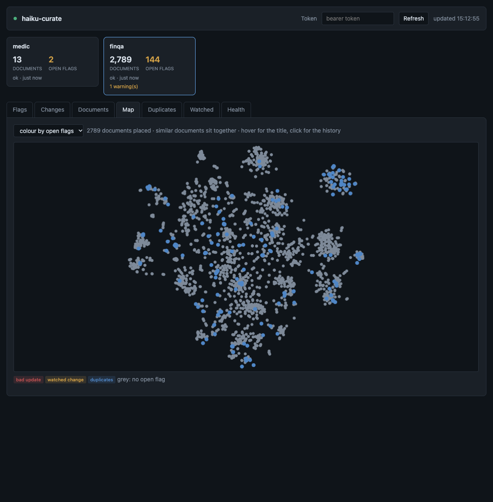

# Curator

`haiku-curate` reports problems in haiku.rag databases that ingestion does not: an update whose extracted text is garbled, documents duplicated within or across databases, text repeated across many documents, missing metadata, and the structural faults `haiku-rag doctor` finds. It reads each database read-only, records the document revisions it sees in its own store, and serves a dashboard where a curator reviews and acknowledges what it found.

It never writes to a database. A bad document is fixed at its source and ingested again.

## Install

```bash
pip install 'haiku.rag-slim[curate]'
# or, with the full package:
pip install 'haiku.rag[curate]'
```

The extra pulls `fastapi`, `uvicorn`, `sqlalchemy`, `aiosqlite`, `asyncpg` and `scikit-learn`. The full Docker image includes it and the published slim image does not, see [Docker](installation.md#docker). Curate reads the vectors stored in each database and never embeds, so it needs no embedding provider, API key or model.

## Configure

Curate covers the databases in [`lancedb.databases`](configuration/multiple-databases.md), or the names listed in `curate.databases`. Vectors are only compared within one database, so the databases can use different embedders. When each database is ingested with its own configuration, give curate a configuration that lists all of them.

```yaml
lancedb:
  databases:
    handbook: /data/handbook.lancedb
    policies: s3://corpora/policies.lancedb

curate:
  store:
    path: ~/.local/share/haiku.rag/curate.db   # default: the data directory
    dburi: null                                # e.g. postgresql+asyncpg://user:pw@host/db
  databases: null                              # names from lancedb.databases, null for all
  sweep_interval_s: 3600                       # serve only
  thresholds:
    update_cosine: 0.85                        # bad_update below this centroid cosine
    size_factor: 3.0                           # bad_update when characters or chunks change more than this
    replacement_chars_per_1k: 200              # bad_document above this many U+FFFD per 1000 characters
    short_chunk_chars: 50                      # a shorter chunk counts as short
    isolation_neighbours: 5                    # neighbours the isolation score averages over
  duplicates:
    similarity_threshold: 0.97                 # centroid cosine for a duplicate group
    min_chunks: 3                              # smaller documents are not compared
  repeated_chunks:
    min_documents: 5                           # documents sharing a chunk text before it is flagged
    min_chars: 20                              # shorter chunk texts are ignored
  required_metadata: []                        # keys every document must carry
  api:
    enabled: true
    host: 127.0.0.1
    port: 8766
    auth_token: ${CURATE_TOKEN}                # loading fails if CURATE_TOKEN is unset, omit the key for no token
    root_path: ""                              # e.g. /curate behind a proxy
```

## Run it

```bash
haiku-curate sweep                 # sweep every database once and exit
haiku-curate serve                 # sweep every curate.sweep_interval_s and serve the API
haiku-curate serve --no-sweep      # serve the API only
haiku-curate store init            # create the store
haiku-curate store migrate         # apply pending store migrations
```

`--config`/`-c` names the configuration file. `sweep` prints one line per database and exits 1 when a database cannot be swept, for example because it is missing or needs a migration. Flags never change the exit status. `serve` stops on `SIGINT` or `SIGTERM`.

### With batch ingestion

When [`haiku-ingester run-batch`](ingester.md#one-shot-batch-build) fills the databases on a schedule, run a sweep after each batch and serve the dashboard separately:

```bash
# crontab
0 * * * * haiku-ingester -c handbook.yaml run-batch; haiku-ingester -c policies.yaml run-batch; haiku-curate -c curate.yaml sweep
```

```bash
haiku-curate -c curate.yaml serve --no-sweep
```

A sweep that runs while a document is being written can record it half-written, for example with its old chunks deleted and the new ones not yet added, and raise a flag on that state. The next sweep records the finished revision and supersedes the flag. Sweeping after the batch avoids this.

## What a sweep records

A sweep compares each database's table versions with the last sweep's. An unchanged database is not read again. Otherwise the sweep reads document metadata and chunk ids, and reads chunk text and vectors only for documents whose content changed.

- **Revisions.** A document's content is its md5 and its set of chunk ids. Each time the content changes, the sweep records a revision: the centroid of its chunk vectors, chunk and character counts, chunk length percentiles, the count of U+FFFD characters, a hash of each chunk text, and the embedder. Content that changes from A to B and back to A is three revisions. A change of metadata or title updates the current revision. A revision ingested and replaced between two sweeps is never seen.
- **Deletions.** A document that is gone ends its current revision.
- **Embedder changes.** When a database's recorded embedder changes, every document gets a new revision, and no update is compared across the change.
- **Isolation.** One minus the mean centroid cosine to a document's nearest neighbours in the same database. A high value marks a document unlike the rest. It is a score, never a flag.
- **Health.** For a database that changed, doctor's structural checks: full-text index coverage, document and chunk consistency, unembedded chunks, vector dimension, picture data, settings, pending migrations and the vector index. Duplicate detection and embedding drift are left to curate's own checks.

Flags are re-evaluated on every sweep, unchanged databases included, so a new watch or a change to `required_metadata` applies at the next sweep.

The store keeps every revision and nothing prunes it. For 2,500 web pages the first sweep wrote about 115 MB, most of it chunk text hashes.

## Flags

| Kind | Raised when |
|---|---|
| `bad_update` | A new revision's centroid cosine to its baseline is below `update_cosine`, or its characters or chunks changed by more than `size_factor` in either direction. The cosine is compared only when both revisions share an embedder |
| `bad_document` | A current revision has no embedded chunks, or more than `replacement_chars_per_1k` U+FFFD characters per 1000 |
| `watched_change` | A watched URI has a new revision |
| `watched_deletion` | A watched URI was deleted |
| `duplicate_group` | Within a database, documents whose centroids have cosine at least `duplicates.similarity_threshold`. Across databases, one file (by md5) in more than one database, one flag per file |
| `repeated_chunk` | One chunk text of at least `min_chars` characters appears in at least `min_documents` documents of a database |
| `missing_metadata` | A current document lacks a key in `required_metadata` |

A revision's baseline is the latest earlier revision of the same URI that is not under an open or superseded `bad_update` flag. After a garbled upload, a corrected upload is compared with the revision before the garbled one.

Each flag has a status:

- `open`: raised and not reviewed.
- `acknowledged`: reviewed, with an optional note. It stays acknowledged while its condition holds, until it is reopened, which sets it back to `open` and drops the note. An acknowledged `bad_update` revision becomes the baseline for the next update.
- `superseded`: a newer revision replaced the flagged one.
- `resolved`: the condition no longer holds. It reopens if the condition returns.

Watching a URI (`POST /watched`, or the dashboard) raises a flag on every change to it, whatever the other checks find.

### Calibration

The default thresholds were set against false positives on about 10,000 documents from public benchmarks: FRAMES, Open RAG Bench and T2-RAGBench.

- Re-ingesting 1,000 unchanged PDFs with a different docling version and embedding server gave a lowest centroid cosine of 0.911 and a largest size change of 2.0×. The defaults flag none of them.
- Updates garbled in simulation, by replacing letters with symbols or with other letters in 30 papers and embedding the result again, gave centroid cosines from 0.37 to 0.79. The default 0.85 flags all of them. With only half the chunks garbled, cosines ranged from 0.79 to 0.93 and most were not flagged.
- U+FFFD appeared in 9 documents, at most 58 per 1000 characters, all for unmapped symbols. The default 200 flags none.

Detection has not been measured on real garbled PDFs, only on simulated garbling. A garbled document ingested for the first time has no baseline, so `bad_update` cannot catch it, and `bad_document` catches it only through U+FFFD. Watch the documents whose every change needs review.

## Dashboard

`haiku-curate serve` serves a dashboard at `/`. It shows one card per database (documents, open flags, last sweep, failed checks) and these tabs:

- **Flags**: document flags with their reasons, filtered by status and kind, acknowledged with a note and reopened.
- **Changes**: documents added, updated and deleted in the last day, week, month or since the first sweep.
- **Documents**: the current documents of a database with chunk statistics, isolation, U+FFFD rate and open flags, sortable by any column.
- **Map**: a t-SNE layout of a database's documents, with similar documents placed near each other, coloured by open flags or by isolation. Hovering shows a document's title, clicking opens its history.
- **Duplicates**: duplicate groups and repeated chunk texts, with the text on request, acknowledged and reopened as in Flags.
- **Watched**: the watch list.
- **Health**: doctor's checks from each database's last changed sweep.

Every document link opens its history: each revision with when it became current and when it was replaced, and its flags.



The map is computed when first requested and kept in memory until the database changes. For 2,789 documents the first request takes about 8 seconds on a laptop. The layout is the same for an unchanged database, and can rearrange after any change.

While `serve` runs its own sweep, the dashboard shows it and refreshes when the sweep ends. A sweep run by `haiku-curate sweep` in another process is not shown.

## HTTP API

The API listens on `127.0.0.1:8766`. `curate.api.auth_token` requires a bearer token on every route except `/` and `/health`, and without one the service logs a warning. On any interface other than loopback, set a token: the API acknowledges flags and edits the watch list. `curate.api.root_path` serves it under a sub-path, as for the [ingester](ingester.md#behind-a-reverse-proxy).

| Method | Path | Returns |
|---|---|---|
| `GET` | `/` | The dashboard. Unauthenticated |
| `GET` | `/health` | Whether `serve` is sweeping, and each database's last sweep. Unauthenticated |
| `GET` | `/databases` | Each database's current documents, open flags, last sweep, embedder, failed and warned checks |
| `GET` | `/health/{database}` | Doctor's checks from the last changed sweep |
| `GET` | `/flags` | Flags filtered by `database`, `kind` and `status` |
| `POST` | `/flags/{id}/acknowledge` | Acknowledges a flag, with an optional `note` |
| `POST` | `/flags/{id}/reopen` | Sets an acknowledged flag back to `open`. 409 for any other status |
| `GET` | `/flags/{id}/text` | The text of a `repeated_chunk` flag, read from its database |
| `GET` | `/changes` | Documents added, updated or deleted at or after `since` (ISO 8601), filtered by `database` |
| `GET` | `/documents` | A database's current documents with their scores and open flags |
| `GET` | `/documents/{database}/{id}/history` | Every revision of a document |
| `GET` | `/map/{database}` | Map positions of a database's documents. Empty below 3 documents |
| `GET`, `POST`, `DELETE` | `/watched` | The watch list. `POST` takes `database`, `uri` and `note`, `DELETE` takes `database` and `uri` |

A `database` filter on `/flags` also returns cross-database duplicate groups with a member in that database. A database outside `curate.databases` answers 404.

## The store

The store is a SQLite file, `curate.db` in the data directory, or a Postgres database when `curate.store.dburi` is set. `sweep` and `serve` create it and apply migrations when they start. `haiku-curate store init` and `store migrate` do the same explicitly, and `--store`/`-s` overrides the SQLite path.
