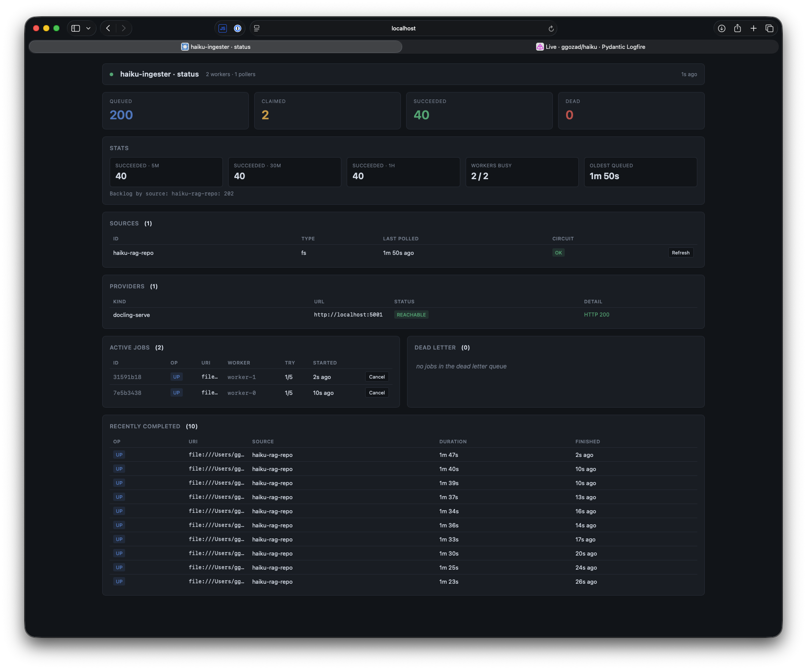

# Ingester

The ingester is a long-running service that watches sources for
changes and feeds documents into haiku.rag's LanceDB. It runs as a
separate process (`haiku-ingester serve`), owns its own job queue
(SQLite by default, or a database server), and exposes a small HTTP
control plane for operations.

Use the ingester when:

- you have a corpus you want to keep in sync continuously
- documents arrive over time from filesystem, S3, or HTTP sources
- you want retry + dead-letter behavior, not "fire and forget"

For one-off ingestion, the `haiku-rag add-src` CLI is enough — see
[CLI → Add Documents](cli.md).

**On this page:**

- [Install](#install)
- [Configure sources](#configure-sources) (FS, S3, HTTP, WebDAV)
- [Workers and retry](#workers-and-retry)
- [Circuit breaker](#circuit-breaker)
- [Run it](#run-it)
- [HTTP control plane](#http-control-plane)
- [Operating](#operating) (smoke test, queue inspection, logs, API)

Single-writer constraint: only one ingester per LanceDB. See
[Storage → Deployment Pattern](configuration/storage.md#deployment-pattern-one-writer-many-readers).

## Install

The ingester ships behind an optional extra:

```bash
pip install 'haiku.rag-slim[ingester]'
# or, for the full package:
pip install 'haiku.rag[ingester]'
```

That pulls `fastapi`, `uvicorn`, `sqlalchemy`, `aiosqlite`, `asyncpg`, and
the `[s3]` extra. The production binary is `haiku-ingester`.

## Configure sources

Add an `ingester:` block to your `haiku.rag.yaml`. The minimum is a
single source:

```yaml
ingester:
  sources:
    - type: fs
      id: local-docs
      root: /Users/you/docs
      delete_orphans: true
```

### Filesystem

```yaml
ingester:
  sources:
    - type: fs
      id: local-docs                          # optional; auto-derives from root
      root: /Users/you/docs
      poll_interval_s: 300
      delete_orphans: true
      ignore_patterns: ["**/.git/**", "**/node_modules/**"]
      include_patterns: ["*.md", "*.pdf"]    # optional whitelist
```

Uses `watchfiles` for push events plus a periodic sweep that catches
anything the OS dropped between starts. Patterns follow
[gitignore syntax](https://git-scm.com/docs/gitignore#_pattern_format).

### S3 / object storage

```yaml
ingester:
  sources:
    - type: s3
      id: corp-docs
      uri: s3://my-bucket/incoming/
      poll_interval_s: 300
      delete_orphans: true
      ignore_patterns: ["draft*"]
      include_patterns: ["*.pdf", "*.md"]
      storage_options:
        endpoint: http://seaweed:8333         # omit for AWS default chain
        aws_access_key_id: ${AWS_KEY}
        aws_secret_access_key: ${AWS_SECRET}
        region: us-east-1
        allow_http: "true"
```

ETags are the cheap-skip key. Each sweep lists the prefix, compares
the listed ETag against the document's stored `metadata["source_revision"]`,
and only fetches keys whose ETag has changed. If the bytes turn out to
match the stored MD5 (multipart re-upload landing a new ETag on the
same content), only the revision is refreshed — no re-chunk.

`storage_options` follows the same convention as `lancedb.storage_options` —
the dict is passed straight to obstore (the Rust `object_store` library
LanceDB uses internally), so credentials configured for the LanceDB
backend can be copy-pasted here.

### HTTP

```yaml
ingester:
  sources:
    - type: http
      id: arxiv
      urls:
        - https://arxiv.org/pdf/2301.12345.pdf
      headers:
        Authorization: Bearer ${SOME_TOKEN}
      poll_interval_s: 86400
```

HTTP is pull-based with HEAD-driven change detection. A `410 Gone`
response from a configured URL triggers a delete event; other failure
statuses fall through to UPSERT-with-no-revision so the worker can
GET and decide.

### WebDAV

```yaml
ingester:
  sources:
    - type: webdav
      id: nextcloud
      base_url: https://nextcloud.example.com/remote.php/dav/files/alice/Documents/
      username: alice
      password: ${NEXTCLOUD_APP_PASSWORD}
      ignore_patterns: ["**/Trash/**"]
      poll_interval_s: 600
```

Each sweep issues one `PROPFIND` with `Depth: infinity` against
`base_url` and parses the multistatus response. Files (non-collection
resources) are emitted as UPSERT / UNCHANGED based on the `getetag`
property (falling back to `getlastmodified` if the server omits it);
URIs that were in the previous snapshot but no longer appear under the
collection are emitted as DELETE.

Fetches are plain HTTP GETs — any WebDAV server already supports them.

Redirects are followed for both `PROPFIND` and `GET`, so front-ended
servers that 30x on trailing-slash normalisation or scheme upgrades (e.g.
Plone) work without extra configuration. Discovered URIs stay anchored to
`base_url` (the `GET` fetch follows redirects to the bytes). A same-host
scheme upgrade (`http`→`https`) is transparent; a redirect that moves the
collection to a different path or host makes discovery raise so you can
point `base_url` at the new location rather than silently dropping every
file. Credentials are never replayed to a different host on a redirect.

Bearer-token auth can replace HTTP Basic via the standard `headers` map:

```yaml
    - type: webdav
      id: kdrive
      base_url: https://kdrive.infomaniak.com/app/drive/123/
      headers:
        Authorization: Bearer ${KDRIVE_TOKEN}
```

### File size limits

Any source can set `max_file_size` (bytes) to reject oversized files
before they are read into memory. Files exceeding the limit go
straight to the DLQ without retrying.

```yaml
    - type: fs
      root: /data/docs
      max_file_size: 104857600        # 100 MB
```

FS and S3 sources know the size before downloading (`stat`, object
metadata), so the limit is always enforced. For HTTP and WebDAV the check
relies on a `Content-Length` response header; a server that omits it (for
example a chunked response) is fetched in full and the limit does not
apply.

### Metadata providers

A source can attach custom metadata to every document it ingests by
naming a `metadata_provider`. The provider is a callable that an external
package registers under the `haiku.rag.metadata_providers` entry-point
group; when the document is fetched for ingestion, the ingester calls it
with `(source_id, uri, result)`, where `result` is the source's
`FetchResult`, and merges the returned dict into the document's metadata.

```yaml
    - type: webdav
      id: handbook
      base_url: https://dav.example.com/remote.php/dav/files/svc
      metadata_provider: example-provider
```

The provider is a zero-argument callable returning the provider instance,
so a class is its own factory:

```python
# example_pkg/__init__.py
from urllib.parse import urlparse

from haiku.rag.ingester.sources import FetchResult


class Provider:
    async def __call__(
        self, source_id: str, uri: str, result: FetchResult
    ) -> dict:
        path = urlparse(uri).path
        return {
            "collection": source_id,
            "folder": path.rsplit("/", 1)[0] or "/",
            "bytes": str(len(result.body)),
        }
```

```toml
# in the provider package's pyproject.toml
[project.entry-points."haiku.rag.metadata_providers"]
example-provider = "example_pkg:Provider"
```

The provider is built once at startup, so it can hold a client or cache
across calls. When a document's source revision is unchanged, the
ingester keeps the existing cheap HEAD short-circuit and preserves the
stored provider metadata; the provider runs again when the document is
fetched for a new or changed revision. The source-derived keys (`md5`,
`source_revision`, `content_type`) are stripped from provider output, so
a provider cannot override them. A `metadata_provider` name with no
installed entry point fails at startup. A provider exception is
classified like any other ingestion error (network and timeout errors
retry; others go to the DLQ).

### Custom sources

The four built-in source types (`fs`, `http`, `s3`, `webdav`) cover the
common cases. To ingest from something else (a git host, a ticketing
system, a bespoke API), an external package registers a source factory
under the `haiku.rag.sources` entry-point group and a config references it
with `type: plugin`.

```yaml
    - type: plugin
      id: api-docs
      plugin: git
      options:
        owner: acme
        repo: api
        branch: main
        token: ${SCM_TOKEN}
```

`plugin` is the entry-point name. `options` is an opaque mapping passed
straight to the factory, which validates it however it likes (for example
with its own Pydantic model). The base fields on every source
(`id`, `poll_interval_s`, `delete_orphans`, `max_file_size`, `retry`,
`circuit_breaker`, `metadata_provider`) are handled by the ingester and
are not part of `options`.

The factory is called with the source id, the validated `options`, and the
ambient extension and size limits, and returns a `Source`:

```python
def __call__(
    self,
    *,
    source_id: str,
    options: dict,
    supported_extensions: list[str] | None,
    max_file_size: int | None,
) -> Source: ...
```

A `Source` implements this protocol:

```python
class Source(Protocol):
    source_id: str

    def supports(self, uri: str) -> bool: ...

    # Current revision for `uri`, cheaply, or None if there is no cheap
    # lookup. Lets the pipeline skip re-ingest when the revision is unchanged.
    async def head(self, uri: str) -> str | None: ...

    # Release resources (connection pools, etc.). Called once at shutdown.
    async def aclose(self) -> None: ...

    async def fetch(self, uri: str) -> FetchResult: ...

    # Yield UPSERT / UNCHANGED / DELETE events. `since` is the uri -> revision
    # snapshot from the previous sweep so the source can emit only deltas.
    def discover(
        self,
        since: RevisionSnapshot | None = None,
        *,
        known_uris: set[str] | None = None,
    ) -> AsyncIterator[SourceEvent]: ...
```

`FetchResult`, `SourceEvent`, `SourceEventKind`, and `RevisionSnapshot`
live in `haiku.rag.ingester.sources`.

```toml
# in the source package's pyproject.toml
[project.entry-points."haiku.rag.sources"]
git = "example_pkg:build_git_source"
```

Only the plugin a source references is imported, so an unused plugin with a
missing optional dependency does not break startup. A `plugin` name with no
installed entry point fails at startup, as does a factory that returns
something that is not a `Source`.

Two limits to know:

- Custom sources are reached through configured discovery and the job
  queue, not through one-shot `haiku-rag add-src <uri>`, which only knows
  the built-in URI schemes.
- Change detection is per `(source, uri)`. A source that needs a single
  per-source cursor (for example a git last-commit SHA) tracks it itself,
  by encoding it in each URI's revision or stashing it under a sentinel URI.

## Workers and retry

```yaml
ingester:
  workers:
    worker_count: 4
    poll_idle_interval_s: 1.0
    claim_timeout_s: 1800
    reaper_interval_s: 60
    shutdown_grace_s: 60            # SIGTERM drains in-flight up to this long
    retry:
      max_attempts: 5
      base_delay_s: 2.0
      max_delay_s: 300.0
      jitter: 0.25                  # ±25%
```

The worker pool runs `worker_count` async workers, each processing one
job at a time. `worker_count` is therefore also the maximum number of
concurrent in-flight jobs. Jobs that hit a `TransientError` are
rescheduled with exponential backoff plus jitter, up to `max_attempts`,
then land in the dead-letter queue. `PermanentError` (unsupported
extension, 4xx HTTP except 408/429, etc.) skips retry entirely.

A reaper task resets jobs whose `claimed_at` is older than
`claim_timeout_s` so a crashed worker doesn't strand its job.

**Backpressure.** Each poller skips its periodic sweep when its source
already has queued or claimed jobs in the queue. The unique-index dedup
would coalesce a re-sweep anyway; the skip saves the listing round-trip
(`PROPFIND` / `S3 LIST` / FS walk). FS push events from `watchfiles`
still flow during a skipped sweep, so new files aren't lost.

**Graceful shutdown.** On `SIGINT` / `SIGTERM`, pollers stop immediately
and workers are given `shutdown_grace_s` to finish in-flight jobs. Jobs
still running after the grace window are cancelled — they stay
`claimed` in the queue and are reset by the reaper on the next start
once `claim_timeout_s` elapses.

**Tuning.**

- `claim_timeout_s` must exceed the longest legitimate job duration; a
  shorter value lets the reaper resurrect in-flight jobs.
- `worker_count` should match downstream capacity. docling-serve
  processes one task per instance, so `worker_count` above the number
  of `providers.docling_serve.base_url` entries over-subscribes the
  fleet — extra submissions queue inside docling-serve and inflate
  `claimed_at` duration toward `claim_timeout_s`.
- `poll_idle_interval_s`: lower = faster pickup, more SQLite churn.
- `reaper_interval_s`: worst-case post-crash reclaim is
  `claim_timeout_s + reaper_interval_s`.

**Per-source override.** A source can opt out of the global retry
policy:

```yaml
ingester:
  sources:
    - type: http
      id: flaky-api
      urls: [...]
      retry:
        max_attempts: 10
        base_delay_s: 10
```

## Circuit breaker

After N consecutive `discover()` failures, a source's circuit breaker
opens and polling pauses for a cooldown. Other sources keep running.

```yaml
ingester:
  sources:
    - type: http
      id: rate-limited
      urls: [...]
      circuit_breaker:
        failure_threshold: 5
        cooldown_s: 600
```

## Run it

```bash
haiku-ingester serve                          # workers + pollers + API
haiku-ingester serve --no-api                 # workers + pollers only
haiku-ingester serve --db /path.lancedb       # explicit DB
haiku-ingester serve --host 0.0.0.0           # bind API on all interfaces
haiku-ingester serve --port 9000              # override API port
```

`--host` and `--port` are CLI overrides for `ingester.api.host` and
`ingester.api.port` in `haiku.rag.yaml`. Both default to the YAML value
(which itself defaults to `127.0.0.1:8765` — loopback only).

The service blocks until SIGINT or SIGTERM. Shutdown drains the API
server, then pollers, then in-flight workers.

### Single-writer constraint

LanceDB supports exactly one writer + N readers per database URI. Run
exactly one `haiku-ingester serve` against a given LanceDB. Multiple
MCP servers or read-only consumers against the same DB are fine.

## HTTP control plane

By default the ingester exposes a FastAPI control plane on
`127.0.0.1:8765`. Set `ingester.api.auth_token` to require a Bearer
token; without one the API stays open and the service logs a warning.

!!! warning "Non-loopback binds need a token"
    Loopback (`127.0.0.1`) is local-only and safe to leave open. If
    you bind to any other interface (`0.0.0.0`, a LAN IP, behind a
    reverse proxy) **set `auth_token`** — the control plane can
    cancel jobs, retry from the DLQ, and trigger source refreshes.
    The startup warning is your only signal that you forgot.

| Method | Path | Purpose |
|---|---|---|
| `GET` | `/` | browser dashboard (HTML; unauthenticated, the JS attaches the bearer on its own JSON fetches) |
| `GET` | `/health` | liveness + queue counts + live worker/poller counts; `status` is `"ok"` or `"degraded"` |
| `GET` | `/sources` | configured pollers + last-poll time + breaker state + last skip reason |
| `POST` | `/sources/{id}/refresh` | force an out-of-band sweep |
| `GET` | `/jobs` | filtered list (`status`, `source_id`, `uri`, `limit`, `offset`) |
| `GET` | `/jobs/{id}` | one job |
| `POST` | `/jobs/{id}/retry` | reset attempts to 0, status to queued |
| `DELETE` | `/jobs/{id}` | cancel a queued/claimed job |
| `GET` | `/dlq` | dead jobs |
| `POST` | `/dlq/{id}/retry` | resurrect from DLQ |
| `GET` | `/stats` | rolling throughput (5m / 30m / 1h succeeded), worker occupancy, oldest queued age, per-source DLQ + backlog |
| `GET` | `/database` | LanceDB snapshot — stored version, embeddings, per-table row counts/sizes, vector index status, pending migrations, package versions (same data as `haiku-rag info`) |
| `GET` | `/config` | full effective configuration (defaults filled in) as YAML, with secrets redacted |

OpenAPI docs at `http://localhost:8765/docs`. The dashboard at `/` polls
the JSON endpoints above every few seconds and surfaces the same data
visually — queue depth chips, per-source health with a `queue busy` badge
when sweeps are skipped, throughput counters, active jobs with a Cancel
button, recent failures with a Retry button, and the last-completed
feed. The Database and Configuration panels are collapsed and load on
demand (the Database panel has a Refresh button) rather than on the poll
loop.



```yaml
ingester:
  api:
    enabled: true
    host: 127.0.0.1
    port: 8765
    auth_token: secret                        # null → unauthenticated
    root_path: ""                             # e.g. /ingester behind a proxy
```

### Behind a reverse proxy

To serve the control plane under a sub-path (so a reverse proxy can front
it alongside other services on one origin, e.g. `https://host/ingester/`),
set `ingester.api.root_path` (or `serve --root-path /ingester`). It is
forwarded to FastAPI/uvicorn as `root_path` — OpenAPI/`/docs` links become
prefix-aware — and the dashboard is served with a matching `<base href>` so
its JSON fetches resolve under the prefix. The value is normalized to a
single leading slash with no trailing slash (`ingester`, `/ingester/` and
`/` become `/ingester`, `/ingester` and `""`). Strip the prefix at the proxy
before forwarding; for example, with nginx:

```nginx
# Redirect the bare prefix to the trailing-slash form so the dashboard's
# <base href> resolves correctly.
location = /ingester {
    return 308 /ingester/;
}

location /ingester/ {
    rewrite ^/ingester/?(.*)$ /$1 break;
    proxy_pass http://127.0.0.1:8765;
}
```

## Operating

### One-shot batch build

`run-batch` runs a single discover sweep across every configured source,
drains the queue, then exits. New and changed resources are ingested,
resources that vanished from a source are deleted. The periodic poller
loops never start, so the run is deterministic and finishes as soon as the
queue is empty. This is the mode for building a database in CI or on a
schedule rather than running the service continuously.

```bash
haiku-ingester run-batch
haiku-ingester run-batch --db rag.lancedb
```

Orphan deletion compares each source against `sync_state` in the queue DB,
so persist `ingester.db` between runs for deletions to be detected. It exits
non-zero if any job dead-letters or a source's discovery sweep does not
complete.

### The queue

The ingester's SQLite queue lives at
`~/Library/Application Support/haiku.rag/ingester.db` on macOS
(platform user data dir; configurable via `ingester.queue.path`). It's
created automatically by `serve`.

For ops setup you can pre-create it:

```bash
haiku-ingester queue init             # create the DB and schema
haiku-ingester queue migrate          # apply pending schema changes
```

Terminal job rows (`succeeded` and `dead`) are kept for history and pruned by
the reaper once they age past `retention_days`:

```yaml
ingester:
  queue:
    path: /var/lib/haiku-rag/ingester.db
    retention_days: 30                # null disables pruning
```

The reaper deletes terminal rows whose `completed_at` is older than the window
on its `reaper_interval_s` cadence. Set `retention_days: null` to keep all
terminal rows.

#### Using a database server

If you already run a database server, point the queue at it with
`ingester.queue.dburi`, a SQLAlchemy async URL. SQLite is used when `dburi` is
unset.

```yaml
ingester:
  queue:
    dburi: postgresql+asyncpg://haiku:secret@db:5432/haiku_rag
```

Postgres (`postgresql+asyncpg://`) is supported alongside the default SQLite.
The `asyncpg` driver ships with the `[ingester]` extra. `dburi` overrides
`path`, and the `--queue` CLI flag is ignored while it is set. Create the schema
the same way as for SQLite:

```bash
haiku-ingester queue init
```

Workers claim jobs with `FOR UPDATE SKIP LOCKED`, so several `haiku-ingester
serve` processes can share one Postgres queue and scale out horizontally. One
caveat: idle workers wake on new work instantly only within their own process.
Workers in other processes pick up enqueued jobs on their next
`poll_idle_interval_s` tick rather than immediately.

### Logs

The service logs via Python `logging` to stderr through a Rich handler.
A typical run looks like:

```
INFO     Ingester running: 4 worker(s), 1 source(s)
INFO     API listening on 127.0.0.1:8765
INFO     Swept local-docs: 142 upsert, 0 delete, 8 unchanged
INFO     Processing upsert file:///.../a.md (job 5d9a...)
INFO     Job 5d9a... succeeded in 0.34s: file:///.../a.md
```

When `LOGFIRE_TOKEN` is set, spans are also shipped to Logfire.

### Operating against the API

```bash
TOKEN=$INGESTER_TOKEN   # omit -H entirely if no token configured

curl http://localhost:8765/health
curl -H "Authorization: Bearer $TOKEN" http://localhost:8765/sources
curl -H "Authorization: Bearer $TOKEN" 'http://localhost:8765/jobs?status=dead'

# Force a poll now
curl -H "Authorization: Bearer $TOKEN" -X POST \
    http://localhost:8765/sources/local-docs/refresh

# Resurrect a dead job
curl -H "Authorization: Bearer $TOKEN" -X POST \
    http://localhost:8765/jobs/<id>/retry
```
