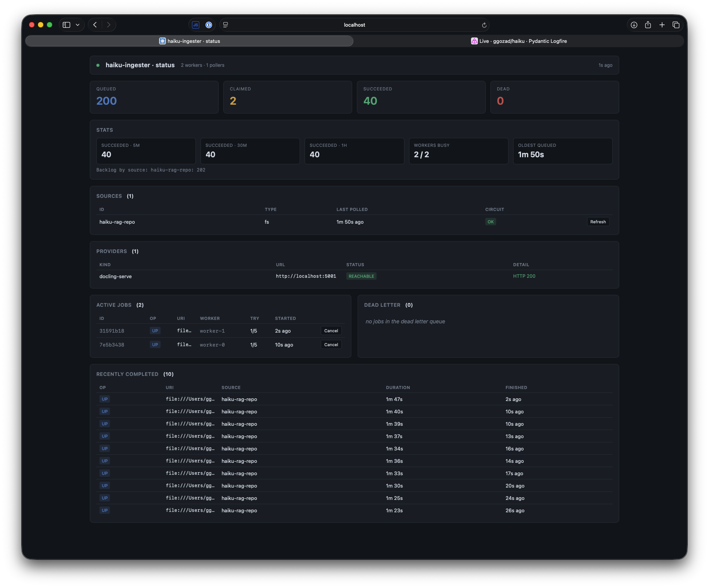

# Ingester

`haiku-ingester` is a long-running service that watches sources for changes and keeps a haiku.rag database in step with them. It runs as its own process, keeps a job queue (SQLite by default, or Postgres) with retries and a dead-letter queue, and serves an HTTP control plane with a dashboard.

For one-off ingestion, `haiku-rag add-src` is enough, see [CLI](cli.md#add).

Run one ingester per database: haiku.rag allows one writing process per database (see [Operational constraints](configuration/storage.md#operational-constraints)). MCP servers and other read-only consumers can run beside it.

## Install

```bash
pip install 'haiku.rag-slim[ingester]'
# or, with the full package:
pip install 'haiku.rag[ingester]'
```

The extra pulls `fastapi`, `uvicorn`, `sqlalchemy`, `aiosqlite`, `asyncpg` and the `s3` extra.

## Configure sources

Sources are listed under `ingester.sources` in `haiku.rag.yaml`. The minimum is one:

```yaml
ingester:
  sources:
    - type: fs
      id: local-docs
      root: /Users/you/docs
      delete_orphans: true
```

Every source takes `id`, `poll_interval_s`, `delete_orphans`, `max_file_size`, `retry`, `circuit_breaker` and `metadata_provider`. With `delete_orphans`, a document whose file disappears from the source is deleted. Without it, the document stays. `ignore_patterns` and `include_patterns` follow [gitignore syntax](https://git-scm.com/docs/gitignore#_pattern_format).

### Filesystem

```yaml
ingester:
  sources:
    - type: fs
      id: local-docs                          # optional, derived from root
      root: /Users/you/docs
      poll_interval_s: 300
      delete_orphans: true
      ignore_patterns: ["**/.git/**", "**/node_modules/**"]
      include_patterns: ["*.md", "*.pdf"]    # optional allow-list
```

`watchfiles` delivers changes as they happen, and a periodic sweep catches anything missed while the service was down.

### S3 and object storage

```yaml
ingester:
  sources:
    - type: s3
      id: corp-docs
      uri: s3://my-bucket/incoming/
      poll_interval_s: 300
      delete_orphans: true
      ignore_patterns: ["draft*"]
      include_patterns: ["*.pdf", "*.md"]
      storage_options:
        endpoint: http://seaweed:8333         # omit for the AWS default chain
        aws_access_key_id: ${AWS_KEY}
        aws_secret_access_key: ${AWS_SECRET}
        region: us-east-1
        allow_http: "true"
```

Each sweep lists the prefix and fetches only keys whose ETag differs from the document's stored `metadata["source_revision"]`. When the fetched bytes match the stored MD5, as after a multipart re-upload, only the revision is updated and nothing is re-chunked.

`storage_options` takes the same keys as `lancedb.storage_options`, so credentials written for the database work here too.

### HTTP

```yaml
ingester:
  sources:
    - type: http
      id: arxiv
      urls:
        - https://arxiv.org/pdf/2301.12345.pdf
      headers:
        Authorization: Bearer ${SOME_TOKEN}
      poll_interval_s: 86400
```

Change detection uses `HEAD`. A URL removed from `urls`, or answering `410 Gone`, counts as gone. Other failures leave the decision to the fetch. A URL whose server sends neither `ETag` nor `Last-Modified` is not fetched again once ingested.

### WebDAV

```yaml
ingester:
  sources:
    - type: webdav
      id: nextcloud
      base_url: https://nextcloud.example.com/remote.php/dav/files/alice/Documents/
      username: alice
      password: ${NEXTCLOUD_APP_PASSWORD}
      ignore_patterns: ["**/Trash/**"]
      poll_interval_s: 600
```

Each sweep issues one `PROPFIND` with `Depth: infinity` against `base_url`. A file's `getetag`, or `getlastmodified` when the server sends no ETag, decides whether it changed. A file missing from the listing counts as gone. Fetches are plain `GET`s.

Redirects are followed for both `PROPFIND` and `GET`, so servers that redirect for a trailing slash or `http` to `https` work unchanged. A redirect that moves the collection to another path or host fails discovery, so the source can be pointed at the new location. Credentials are never sent to a different host.

`headers` can replace HTTP Basic with a bearer token:

```yaml
    - type: webdav
      id: kdrive
      base_url: https://kdrive.infomaniak.com/app/drive/123/
      headers:
        Authorization: Bearer ${KDRIVE_TOKEN}
```

### File size limits

`max_file_size` (bytes) rejects oversized files before they are read into memory. They go straight to the dead-letter queue.

```yaml
    - type: fs
      root: /data/docs
      max_file_size: 104857600        # 100 MB
```

FS and S3 sources know the size before downloading, so the limit always applies. HTTP and WebDAV rely on the `Content-Length` header, and a response without one, such as a chunked response, is fetched in full.

### Metadata providers

A source can attach custom metadata to every document it ingests through a `metadata_provider`, a callable an external package registers under the `haiku.rag.metadata_providers` entry-point group:

```yaml
    - type: webdav
      id: handbook
      base_url: https://dav.example.com/remote.php/dav/files/svc
      metadata_provider: example-provider
```

The entry point is a zero-argument callable returning the provider, so a class is its own factory. The ingester calls the provider with `(source_id, uri, result)`, where `result` is the source's `FetchResult`, and merges the returned dict into the document's metadata:

```python
# example_pkg/__init__.py
from urllib.parse import urlparse

from haiku.rag.sources import FetchResult


class Provider:
    async def __call__(
        self, source_id: str, uri: str, result: FetchResult
    ) -> dict:
        path = urlparse(uri).path
        return {
            "collection": source_id,
            "folder": path.rsplit("/", 1)[0] or "/",
            "bytes": str(len(result.body)),
        }
```

```toml
# in the provider package's pyproject.toml
[project.entry-points."haiku.rag.metadata_providers"]
example-provider = "example_pkg:Provider"
```

The provider is built once at startup, so it can hold a client or a cache. It runs when a document is fetched for a new or changed revision. An unchanged document is skipped without a fetch and keeps its stored provider metadata. The keys `md5`, `source_revision`, `content_type` and `source_id` are removed from provider output. A `metadata_provider` with no installed entry point fails startup. A provider exception is handled like any ingestion error: network and timeout errors retry, others go to the dead-letter queue.

### Custom sources

To ingest from something the four built-in types (`fs`, `http`, `s3`, `webdav`) do not cover, such as a git host or a ticketing system, a package registers a source factory under the `haiku.rag.sources` entry-point group and the configuration names it with `type: plugin`:

```yaml
    - type: plugin
      id: api-docs
      plugin: git
      options:
        owner: acme
        repo: api
        branch: main
        token: ${SCM_TOKEN}
```

`plugin` is the entry-point name. `options` is passed to the factory as given, and the factory validates it. The base source fields are handled by the ingester and are not part of `options`.

The factory takes the source id, the options, and the extension and size limits, and returns a `Source`:

```python
def __call__(
    self,
    *,
    source_id: str,
    options: dict,
    supported_extensions: list[str] | None,
    max_file_size: int | None,
) -> Source: ...
```

```python
class Source(Protocol):
    source_id: str

    def supports(self, uri: str) -> bool: ...

    # Current revision for `uri`, or None when there is no cheap lookup.
    async def head(self, uri: str) -> str | None: ...

    # Release resources (connection pools, etc.). Called once at shutdown.
    async def aclose(self) -> None: ...

    async def fetch(self, uri: str) -> FetchResult: ...

    # Yield UPSERT / UNCHANGED / DELETE events. `since` is the uri -> revision
    # snapshot from the previous sweep, so the source can emit only changes.
    def discover(
        self,
        since: RevisionSnapshot | None = None,
        *,
        known_uris: set[str] | None = None,
    ) -> AsyncIterator[SourceEvent]: ...
```

`FetchResult`, `SourceEvent`, `SourceEventKind` and `RevisionSnapshot` are in `haiku.rag.sources`.

```toml
# in the source package's pyproject.toml
[project.entry-points."haiku.rag.sources"]
git = "example_pkg:build_git_source"
```

Only plugins a source references are imported. A `plugin` name with no installed entry point fails startup, as does a factory that returns something other than a `Source`.

Custom sources are reached through the ingester only, not through `haiku-rag add-src`. Change detection is per source and URI, so a source that needs one cursor for the whole source (a git commit SHA, say) keeps it in each URI's revision or under a sentinel URI.

## Workers and retry

```yaml
ingester:
  workers:
    worker_count: 4
    poll_idle_interval_s: 1.0
    lease_ttl_s: 120
    heartbeat_interval_s: 30
    reaper_interval_s: 60
    shutdown_grace_s: 60            # SIGTERM drains in-flight jobs up to this long
    retry:
      max_attempts: 5
      base_delay_s: 2.0
      max_delay_s: 300.0
      jitter: 0.25                  # ±25%
```

`worker_count` workers each process one job at a time, so it is also the most jobs in flight. A job failing with a transient error is retried with exponential backoff and jitter up to `max_attempts`, then moves to the dead-letter queue. A permanent error skips retries: an unsupported extension, an HTTP 4xx other than 408 and 429, an object-store credential or configuration error.

A worker renews its job's lease every `heartbeat_interval_s`. The reaper returns a job to the queue when its lease has not been renewed for `lease_ttl_s`, so a crashed worker's job is picked up again. A slow job keeps renewing and is never reaped while it runs.

- `lease_ttl_s` bounds how long a crashed worker's job waits before another worker takes it. It need not exceed job duration.
- `heartbeat_interval_s` must be at most `lease_ttl_s / 3`.
- `worker_count` should match downstream capacity. With docling-serve, start at 1–2× the number of `providers.docling_serve.base_url` entries, see [Remote processing](remote-processing.md#several-instances).
- `poll_idle_interval_s`: lower picks up work faster and queries the queue more often.
- `reaper_interval_s`: a crashed worker's job is reclaimed within `lease_ttl_s + reaper_interval_s`.

A poller skips its periodic sweep while its source has queued or claimed jobs. Filesystem change events still flow during a skipped sweep.

On `SIGINT` or `SIGTERM`, pollers stop and workers get `shutdown_grace_s` to finish. Jobs still running after that are cancelled and returned to the queue. A job that cannot be returned is reclaimed by the reaper once its lease expires.

A source can override the retry policy:

```yaml
ingester:
  sources:
    - type: http
      id: flaky-api
      urls: [...]
      retry:
        max_attempts: 10
        base_delay_s: 10
```

## Circuit breaker

After `failure_threshold` consecutive discovery failures, a source's circuit breaker opens and its polling pauses for `cooldown_s`. Other sources keep running.

```yaml
ingester:
  sources:
    - type: http
      id: rate-limited
      urls: [...]
      circuit_breaker:
        failure_threshold: 5
        cooldown_s: 600
```

Workers keep a second breaker per source over job failures. After 5 consecutive transient job failures they stop claiming that source's jobs for 60 seconds. Both values are fixed. `/health` reports the breaker, and opening it emits an `ingester.worker breaker opened` event.

## Run it

```bash
haiku-ingester serve                          # workers, pollers and API
haiku-ingester serve --no-api                 # workers and pollers only
haiku-ingester serve --db /path.lancedb       # explicit database
haiku-ingester serve --host 0.0.0.0           # bind the API on all interfaces
haiku-ingester serve --port 9000              # API port
```

`--host` and `--port` override `ingester.api.host` and `ingester.api.port`, which default to `127.0.0.1:8765`. `--config`/`-c` names the configuration file.

The service runs until `SIGINT` or `SIGTERM`, then stops the API server, the pollers and the workers, in that order.

### Run it under a supervisor

A document can stall docling indefinitely. `processing.conversion_timeout` abandons it, but a stalled PDF or office conversion holds docling's shared converter, so the process cannot convert again. The worker records the document dead and exits non-zero, for the process to be replaced.

So the service needs something to restart it: `restart: unless-stopped` in Compose (the example sets it), `Restart=always` in a systemd unit. Without one, the ingester stops the first time a document stalls. A restart mid-job is safe: the reaper returns the jobs of a vanished process to the queue once their leases expire, without counting the attempt.

The stalled document is not retried by itself. Its dead job keeps discovery from queueing the same revision again, and retention never removes it. It is cleared by:

- a new revision of the file at the source
- `POST /dlq/{job_id}/retry`, once the document is fixed. Retrying a different dead job for the same document and revision answers 409 and names the job in the way
- deleting the document

An HTML or Markdown stall is recorded the same way but does not end the process, since those formats do not share a converter.

## HTTP control plane

The ingester serves a FastAPI control plane on `127.0.0.1:8765`. `ingester.api.auth_token` requires a bearer token on every route except `/` and `/health`. Without a token the API is open and the service logs a warning.

!!! warning "Non-loopback binds need a token"
    Loopback is local-only. On any other interface (`0.0.0.0`, a LAN address, behind a reverse proxy) set `auth_token`: the control plane can cancel jobs, retry dead ones and trigger sweeps. The startup warning is the only sign that it is missing.

| Method | Path | Purpose |
|---|---|---|
| `GET` | `/` | Browser dashboard. Unauthenticated. Its script sends the token on its own requests |
| `GET` | `/health` | Queue counts, live workers and pollers, worker breaker state. `status` is `degraded` when a worker or poller is down or the worker breaker is open. Unauthenticated |
| `GET` | `/sources` | Configured sources, last poll time, breaker state, last skip reason |
| `POST` | `/sources/{id}/refresh` | Run a sweep now. Skipped (`refreshed: false`) while the source has queued or claimed jobs or its breaker is open |
| `GET` | `/jobs` | Jobs filtered by `status`, `source_id`, `uri`, `limit`, `offset` |
| `GET` | `/jobs/{id}` | One job |
| `POST` | `/jobs/{id}/retry` | Reset a dead or queued job to queued with zero attempts. Returns the live job instead when one exists for the same URI |
| `DELETE` | `/jobs/{id}` | Cancel a queued or claimed job |
| `GET` | `/dlq` | Dead jobs, filtered by `source_id`, `limit` (default 50, at most 500), `offset` |
| `POST` | `/dlq/{id}/retry` | Re-queue a dead job |
| `GET` | `/stats` | Throughput over 5 minutes, 30 minutes and 1 hour, worker occupancy, oldest queued age, per-source dead and backlog counts |
| `GET` | `/database` | The database report `haiku-rag info` prints |
| `GET` | `/config` | The effective configuration, defaults filled in and secrets redacted, as YAML text in a JSON `yaml` field |
| `GET` | `/providers` | Reachability of each `providers.docling_serve.base_url` entry (`/health`, 2 s timeout) |

OpenAPI docs are at `/docs`. The dashboard at `/` shows the same data and refreshes every few seconds.



```yaml
ingester:
  api:
    enabled: true
    host: 127.0.0.1
    port: 8765
    auth_token: ${INGESTER_TOKEN}             # unset: unauthenticated
    root_path: ""                             # e.g. /ingester behind a proxy
```

### Behind a reverse proxy

`ingester.api.root_path` (or `serve --root-path /ingester`) serves the control plane under a sub-path, such as `https://host/ingester/`. The OpenAPI docs and the dashboard's requests follow the prefix. The value is normalized to one leading slash and no trailing slash. Strip the prefix at the proxy, for example with nginx:

```nginx
# Redirect the bare prefix to the trailing-slash form, where the dashboard's
# <base href> resolves.
location = /ingester {
    return 308 /ingester/;
}

location /ingester/ {
    rewrite ^/ingester/?(.*)$ /$1 break;
    proxy_pass http://127.0.0.1:8765;
}
```

## Operating

### One-shot batch build

`run-batch` runs one discovery sweep over every source, drains the queue and exits. New and changed files are ingested, and, with `delete_orphans`, documents whose files are gone are deleted. It is the mode for building a database in CI or on a schedule.

```bash
haiku-ingester run-batch
haiku-ingester run-batch --db rag.lancedb
```

It exits non-zero when a job dead-letters or a source's sweep does not complete. Deletion compares each source against the queue's record of what it ingested, so keep `ingester.db` between runs.

`--dry-run` makes the same discovery without queueing anything, and writes the changes it found to a YAML manifest, `manifest-<datestamp>.yaml` unless `--output`/`-o` names one:

```bash
haiku-ingester run-batch --dry-run
haiku-ingester run-batch --dry-run --output manifest-20260622.yaml
```

`--manifest` replays exactly that changeset, without another sweep:

```bash
haiku-ingester run-batch --manifest manifest-20260622.yaml
```

Replay refuses a source with queued or claimed jobs. An upsert with a revision is checked against the source before fetching, and one that changed since the dry run dead-letters, leaving the newer version to the next dry run. A source that reports no revisions cannot prove at replay that the bytes are the ones the dry run saw.

### Which source a document came from

A document the ingester fetches carries `metadata["source_id"]`, the id of the source that ingested it. Documents added with `haiku-rag add-src` have none. Neither do PDF attachments, which belong to their parent document and are deleted with it.

Only ingestion sets `source_id`, and `HaikuRAG.set_document_source`, which startup reconciliation uses. Passing it as metadata does nothing, and re-adding an ingested document by hand keeps it.

A source id is an identity. An `fs` source without an `id` derives it from its root (`fs:{resolved_root}`), and an `s3` source from its bucket and prefix (`s3:{bucket}/{prefix}`). Moving the directory or prefix, or renaming an `id`, detaches every document ingested under the old one. Set `id` on a source whose location may move:

```yaml
ingester:
  sources:
    - type: fs
      id: handbook
      root: /srv/handbook
```

When two sources cover the same URI (nested roots or prefixes, one URL in two `http` sources), the latest ingestion takes ownership and a warning names both ids. Overlapping sources are a configuration error.

### Reconciliation at startup

The ingester's state is in two places: the documents in the database, and the queue's record of what each source ingested, which deletion is computed from. Either can be restored or lost without the other, for example a queue file on container-local storage or a database restored from backup.

Every `serve` and `run-batch` reconciles them before its first sweep. For each source:

- A document the source owns with no queue record gets one back, so the next sweep can delete it if its file is gone.
- A recorded revision for a URI the database no longer holds is cleared, so the next sweep re-ingests it.
- A document without `source_id` that the source's queue records as ingested is attributed to the source, without a fetch.

A permanently failed job also records a revision, which keeps an unchanged failing file from being queued forever. Reconciliation leaves those alone.

A document two sources both ingested stays unattributed, with a warning naming them. Documents of a `source_id` no longer configured are counted in a warning and left alone. Reconciliation reads the document metadata table once and no content.

`run-batch --dry-run` opens no database, so a manifest written while the two disagreed misses the deletions reconciliation would find, and `--manifest` replay does not sweep. A normal sweep afterwards catches up.

### Documents with no source attribution

At startup, reconciliation reports documents that remain unattributed:

```
14 document(s) remain without source attribution. Review whether they are
intentionally unmanaged or have ambiguous or lost ownership.
```

Such a document was added by hand, was ingested by a version that did not record `source_id` and whose queue record is gone, or is claimed by two sources and named in its own warning. The last kind needs the sources separated, not the document deleted. While a lost document's file is still at its source, the next sweep attributes it. Once the file is gone, nothing identifies it.

To clear them:

**1. Run one batch and check it succeeds.**

```bash
haiku-ingester --config /etc/haiku/haiku.rag.yaml run-batch
echo $?    # must be 0
```

Reconciliation attributes what the queue records, and the sweep attributes what it finds. An unchanged document costs no fetch, conversion or embedding. A non-zero exit means a source failed to sweep or a job died, so some live documents may still be unattributed. Fix that and run again before step 2.

**2. List what is left.**

```bash
haiku-rag --config /etc/haiku/haiku.rag.yaml list \
  -f "metadata NOT LIKE '%\"source_id\"%'"
```

Narrow it on a database that also holds hand-added documents:

```bash
  -f "metadata NOT LIKE '%\"source_id\"%' AND uri LIKE 'file:///srv/handbook/%'"
```

`metadata` is matched as JSON text, so a document whose own metadata contains the string `source_id` is left out. The filter can miss an orphan, never offer a live document.

**3. Delete what you confirm.**

```bash
haiku-rag --config /etc/haiku/haiku.rag.yaml delete <id>
```

Read the URIs first. A hand-added document whose file has since moved looks the same as one the ingester lost track of.

### The queue

The SQLite queue is `ingester.db` in the platform data directory (`~/Library/Application Support/haiku.rag/` on macOS), or `ingester.queue.path`. `serve` creates it. To create or migrate it ahead of time:

```bash
haiku-ingester queue init             # create the database and schema
haiku-ingester queue migrate          # apply pending schema changes
haiku-ingester queue init -q /var/lib/haiku-rag/ingester.db   # at another path
```

Succeeded and dead jobs are kept for history. The reaper deletes those completed more than `retention_days` ago:

```yaml
ingester:
  queue:
    path: /var/lib/haiku-rag/ingester.db
    retention_days: 30                # null keeps them all
```

#### Postgres

`ingester.queue.dburi` points the queue at Postgres, with a SQLAlchemy async URL:

```yaml
ingester:
  queue:
    dburi: postgresql+asyncpg://haiku:${POSTGRES_PASSWORD}@db:5432/haiku_rag
```

The `asyncpg` driver comes with the `ingester` extra. `dburi` overrides `path` and the `--queue` flag. `haiku-ingester queue init` creates the schema, as for SQLite.

Several `haiku-ingester serve` processes can share one Postgres queue: workers claim jobs with `FOR UPDATE SKIP LOCKED`, and leases are renewed and reaped correctly across processes. Each still needs a database of its own. Idle workers wake at once for work queued in their own process, and on their next `poll_idle_interval_s` tick for work queued by another.

### Logs and tracing

The service logs to stderr:

```
INFO     Ingester running: 4 worker(s), 1 source(s)
INFO     API listening on 127.0.0.1:8765
INFO     Swept local-docs: 142 upsert, 0 delete, 8 unchanged
INFO     Processing upsert file:///.../a.md (job 5d9a...)
INFO     Job 5d9a... succeeded in 0.34s: file:///.../a.md
```

With `LOGFIRE_TOKEN` set, spans are sent to Logfire with `service.name` `haiku-ingester` and `service.version`. `OTEL_SERVICE_NAME` (or `LOGFIRE_SERVICE_NAME`) names a process differently, to tell concurrent ingesters apart:

```bash
OTEL_SERVICE_NAME=ingester-tenant-a haiku-ingester serve
```

The span tree is `ingester.poller.sweep` → `ingester.job` (with `source_id` and `uri`) → one span per phase: `document.fetch`, `document.convert`, `document.chunk`, `document.embed`, `document.items` and `document.store`. The phase spans are siblings: each times one phase, so a slow `document.store` is a slow write. `document.embed` reports `chunks`, `chunks_embedded`, `images` and `batch_size`, and is emitted when no chunk needs embedding. `document.store` reports `op` (`create` / `update` / `create_batch`), `document_id`, `chunks`, `items` and `lock_wait_ms`, the time spent waiting on the write lock. That lock is in-process, so contention between two ingester processes on one database is not measured. `_prepare_and_title` and `get_all_picture_data` run outside any phase span, so the phases do not sum to the job. Each docling-serve request adds a `docling_serve.request` span with the instance `url` and `attempt`. A worker breaker opening emits an `ingester.worker breaker opened` event with `source_id`, `threshold` and `cooldown_s`.

### Operating against the API

```bash
TOKEN=$INGESTER_TOKEN   # omit -H when no token is configured

curl http://localhost:8765/health
curl -H "Authorization: Bearer $TOKEN" http://localhost:8765/sources
curl -H "Authorization: Bearer $TOKEN" 'http://localhost:8765/jobs?status=dead'

# Sweep a source now
curl -H "Authorization: Bearer $TOKEN" -X POST \
    http://localhost:8765/sources/local-docs/refresh

# Retry a dead job
curl -H "Authorization: Bearer $TOKEN" -X POST \
    http://localhost:8765/jobs/<id>/retry
```
