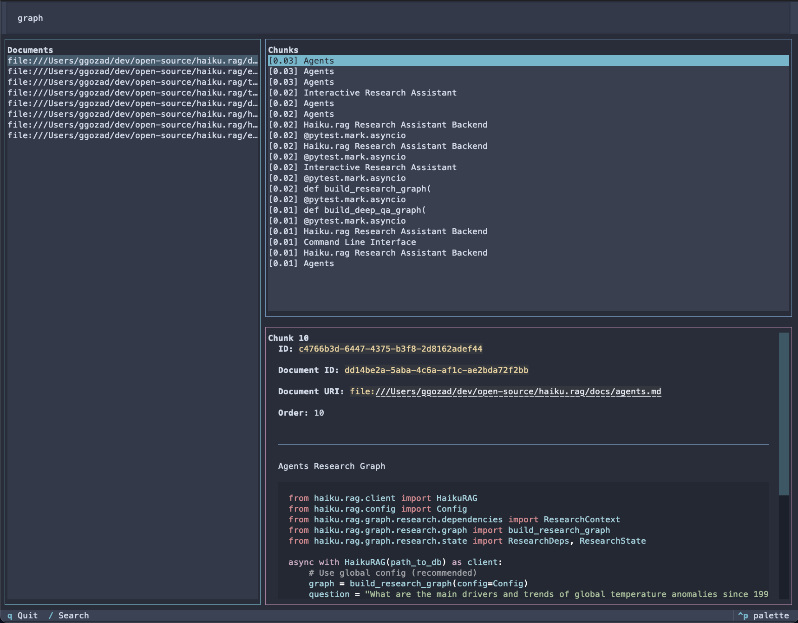

# Database Inspector

Interactive TUI for browsing your LanceDB database.

## Installation

```bash
# For haiku.rag-slim
pip install 'haiku.rag-slim[inspector]'

# Already included in haiku.rag
pip install haiku.rag
```

## Usage

```bash
haiku-rag inspect
haiku-rag inspect --db /path/to/database.lancedb
```

## Interface



Three panels display your data:

- **Documents** (left) - All documents in the database
- **Chunks** (top right) - Chunks for the selected document
- **Detail View** (bottom right) - Full content and metadata

## Navigation

**Keyboard:**

- `Tab` - Cycle between panels
- `↑` / `↓` - Navigate lists
- `/` - Open search modal
- `q` - Quit

**Mouse:** Click to select, scroll to view content

## Search

Press `/` to open the full-screen search modal:

- Enter your query and press `Enter` to search
- **Left panel**: Search results with relevance scores `[0.95] content preview`
- **Right panel**: Full chunk content and metadata
- Use `↑` / `↓` to navigate results - detail view updates in real-time
- Press `Enter` on a result to close search and navigate to that document/chunk
- Press `Esc` to close search without selecting

Search uses hybrid (vector + full-text) search across all chunks. Content is rendered as markdown with syntax highlighting.
