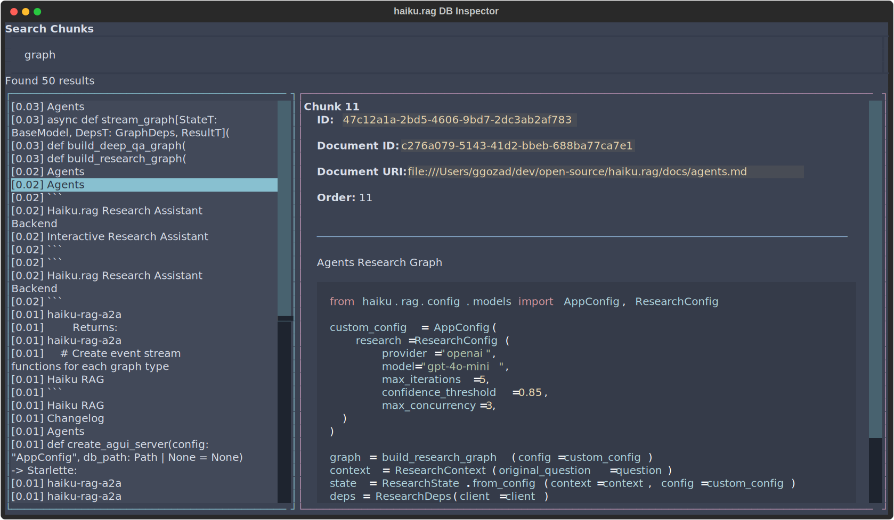
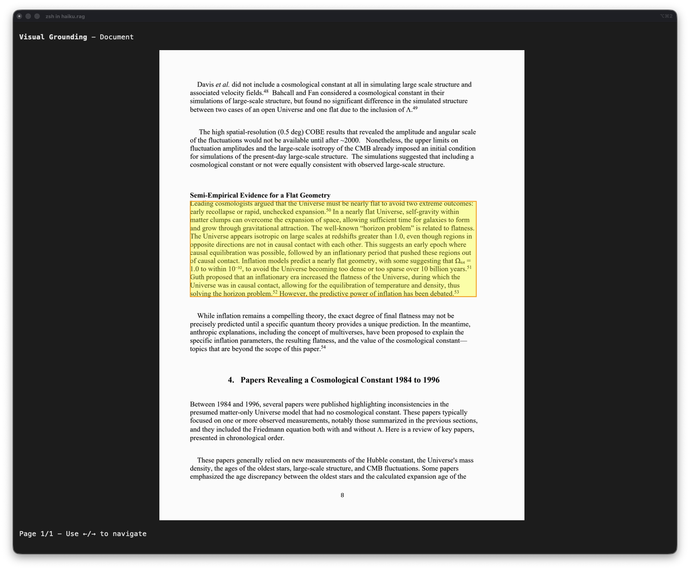

# Tuning

How to adjust haiku.rag's pipeline for better retrieval and answer quality. For individual setting definitions and defaults, see [Configuration](configuration/index.md).

## Pipeline Overview

Documents flow through: **chunking → embedding → hybrid search (vector + FTS) → reranking → context expansion → LLM generation**. Retrieval tuning (chunking through reranking) is highest-leverage — if the LLM never sees the right chunks, no prompt or model change will help.

## Tuning Retrieval

### Chunking

`chunk_size` controls the granularity of retrieval. Smaller chunks match queries more precisely but carry less context each; larger chunks provide more surrounding information but dilute relevance signals. On the Wix benchmark, increasing from 256 to 512 tokens raised MAP from 0.43 to 0.45 on plain text — a modest gain that also increases token cost per result. See [Processing](configuration/processing.md#chunk-size) for configuration.

`chunker_type` selects between `hybrid` (default) and `hierarchical` chunking. Hierarchical chunking preserves the document's heading structure and works better for deeply nested or structured content. See [Chunking Strategies](configuration/processing.md#chunking-strategies).

### Embedding Model

Larger embedding models produce better representations at the cost of slower indexing and more storage. The choice of embedding model has a larger impact on retrieval quality than most other settings. See [Providers](configuration/providers.md) for available options and [Benchmarks](benchmarks.md) for real comparisons across models.

### Reranking

When configured, a cross-encoder reranker re-scores 10x the requested candidates and returns the top results. This adds latency but improves precision — on the Wix benchmark, adding `mxbai-rerank-base-v2` raised MAP from 0.34 to 0.39 on HTML content. See [Search Settings](configuration/qa.md#search-settings) for how reranking integrates with search.

### Search Settings

`limit` controls how many results reach the LLM. More candidates improve recall but increase token usage. See [Search Settings](configuration/qa.md#search-settings).

Context expansion is automatic and section-aware — search results are expanded to include surrounding content from the same document section. For structured documents, expansion stays within section boundaries and filters noise (footnotes, page headers). For unstructured documents, expansion grows outward until the character budget is filled. `max_context_chars` caps expansion to prevent context bloat.

## Tuning Generation

Model and temperature selection affect answer quality directly — see [Providers](configuration/providers.md#model-settings) for options.

`domain_preamble` prepends domain context to the rag and rag-analysis skill instructions. Use it to describe what the knowledge base contains and clarify domain-specific terminology. See [Prompt Customization](configuration/prompts.md).

## What Requires a Rebuild

| Change | Rebuild required? |
|--------|:-:|
| `chunk_size`, `chunker_type`, `chunking_merge_peers` | Yes — `haiku-rag rebuild` |
| Embedding model | Yes — `haiku-rag rebuild` |
| Search settings, reranking, prompts | No |

## Inspector

The inspector is the fastest way to see what your model would actually receive for a given query. Run it against your database and step through the same hybrid search, context expansion, and chunk previews the rag skill uses at runtime. Press `c` on a chunk and you see the exact context the LLM would get back from a search hit.

```bash
haiku-rag inspect
haiku-rag inspect --db /path/to/database.lancedb
```

!!! note
    Requires the `tui` extra: `pip install haiku.rag-slim[tui]` (included in the full `haiku.rag` package).

### Layout

Three panels:

- **Documents** (left): every document in the database.
- **Chunks** (top right): chunks for the selected document.
- **Detail view** (bottom right): full content and metadata.



### Keys

| Key | Action |
|-----|--------|
| `Tab` | Cycle panels |
| `↑` / `↓` | Navigate lists |
| `/` | Search modal |
| `c` | Context expansion modal (the chunk plus what the agent would see around it) |
| `v` | Visual grounding modal (chunk highlighted on the page) |
| `q` | Quit |

Mouse: click to select, scroll to view content.

### Search

Press `/` to open the search modal. Type a query and press `Enter`. The left panel lists results with relevance scores like `[0.95] content preview`. The right panel shows the full chunk and its metadata. `↑` / `↓` navigates results, `Enter` jumps to the document and chunk, `Esc` closes the modal. Search uses the same hybrid (vector + full-text) retrieval the rag skill uses.

### Context expansion (`c`)

Press `c` on a chunk to see the expanded context that would be fed to the rag skill. This is where you find out whether your `chunk_size`, `chunker_type`, and `max_context_chars` settings actually deliver the surrounding content the model needs. The modal shows:

- The expanded text. Section-aware expansion stays within section boundaries on structured documents and fills `max_context_chars` outward on unstructured ones.
- Source document, content type, and relevance score.
- Filtered noise. Footnotes, page headers and footers are excluded from structured documents.

If `qa.model.vision = true` is set, the modal also renders the picture bytes attached to that chunk, so you see exactly what the vision model would receive.

### Visual grounding (`v`)

Press `v` to highlight the chunk's bounding box on its page image. Useful for verifying chunk boundaries and seeing how Docling carved up the document.

- `←` / `→` to navigate pages when a chunk spans multiple pages.
- `Esc` closes the modal.



Requirements: documents must have page images (default for PDFs), and the terminal must support inline images (iTerm2, WezTerm, Kitty). Plain-text documents added via `haiku-rag add` don't have visual grounding.

You can also visualize a chunk from the CLI without launching the TUI: `haiku-rag visualize <chunk_id>`.

## Measuring Changes

For systematic measurement, use the `evaluations/` workspace which provides retrieval metrics (MRR, MAP) and LLM-judged QA accuracy via `pydantic-evals`:

```bash
# Run retrieval + QA benchmarks
evaluations run <dataset>

# Skip database rebuild when only changing search/reranking/prompt settings
evaluations run <dataset> --skip-db

# Limit test cases for faster iteration
evaluations run <dataset> --limit 50
```

See [Benchmarks](benchmarks.md) for dataset details, methodology, and baseline results.
